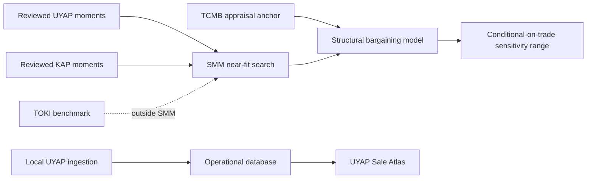

# sold

[](https://github.com/onatozmenn/sold/actions/workflows/ci.yml)
[](https://github.com/onatozmenn/sold/actions/workflows/kfe-refresh.yml)
[](https://www.python.org/)
[](LICENSE)

`sold` is a provenance-aware Turkish property-market research toolkit. It has two active,
deliberately separate surfaces:

| Surface | Purpose | Data boundary |
|---|---|---|
| **UYAP Sale Atlas** | Explore court appraisal values versus finalized judicial-auction prices | Local operational database and artifacts; not included in Git |
| **Structural prototype** | Study model-conditional ordinary-resale price distributions | Small committed, operator-reviewed structural snapshot |

> **Status:** research software, not a deployed valuation service. The project does not
> observe ordinary-resale closing prices and has no measured ordinary-resale prediction
> accuracy. Structural outputs are sensitivity analyses, not appraisals or confidence
> intervals.

Legacy supervised-model, fixed-discount, flywheel, and consumer-submission paths remain in
the repository for compatibility and research history. They are not the active structural
methodology; see [Legacy surfaces](#legacy-surfaces).

## Reproducibility boundary

### Included in a clone

- source code and offline tests;
- official TCMB/TÜİK market-series extracts under [`datasets/`](datasets/);
- normalized structural inputs under [`validation/structural/`](validation/structural/):
  20 UYAP completed auctions, 2 KAP disposals, and 3 TOKİ disclosures;
- committed identification and numerical-stability snapshots.

The structural records are marked `source_audited` after operator review. Native source
documents are intentionally excluded, so a clone can reproduce the normalized-data counts,
moments, and diagnostics but cannot independently re-audit every source document.

### Local only

The operational UYAP ledger, `sold.db`, native UDF artifacts, browser state, and campaign
checkpoints are ignored by Git. A fresh clone therefore starts with an empty Atlas database.

**Operator-reported local snapshot, 2026-07-14:** 13,489 admitted UYAP auction observations
across 80 provinces. This number is not reproducible from repository contents. For any
installation, `GET /uyap-data` reports the database's current `summary.record_count`.

## Method and limits

Türkiye has no public MLS-like source for ordinary-resale closing prices. The active
prototype models a negotiated sale with generalized Nash bargaining:

$$
P = \eta B + (1-\eta)S, \qquad \text{trade only if } B \ge S
$$

Here, `B` is buyer valuation, `S` is seller reservation value, and `eta` is seller bargaining
power. The asking price is treated as a noisy seller-side signal. The level anchor is the
available **province-level TCMB appraisal TL/m2 multiplied by gross area**; it is not a
property-specific appraisal.

Source roles are kept separate:

| Source | Role | Used in SMM? |
|---|---|---|
| **TCMB** | Province-level appraisal anchor and price-index context | No |
| **TÜİK** | Housing-sales volume context | No |
| **UYAP structural snapshot** | Two moments of `auction price / appraisal`, conditional on completed sale | Yes |
| **KAP structural snapshot** | Two moments of `log(sale / appraisal)` for reviewed corporate disposals | Yes |
| **TOKİ** | External cross-mechanism benchmark | No |
| **Operational UYAP registry** | Local Atlas and FairValue records | No automatic structural admission |

The committed structural diagnostic has four observed moments for ten free parameters and a
local Jacobian rank of 4. Its status is therefore `STRUCTURALLY_UNDERIDENTIFIED`. In
particular:

- `eta` is varied jointly in a bounded SMM search; it is not point identified;
- `admissible_near_fit_set` (`Theta_A`) is a heuristic near-fit sensitivity set, not a
  formally estimated identified set or confidence region;
- the committed numerical search diagnostic is `INSUFFICIENT_COVERAGE` and is distinct from
  econometric identification;
- price distributions are conditional on simulated trade (`B >= S`);
- simulated trade shares are not empirical probabilities of sale;
- operational Atlas records never recalibrate the structural snapshot automatically.



The structural implementation is under [`src/sold/structural/`](src/sold/structural/).
Historical design changes and superseded claims are preserved in
[`docs/DEVELOPMENT_HISTORY.md`](docs/DEVELOPMENT_HISTORY.md).

## Quickstart

Prerequisites: Python 3.11+ and Git. An EVDS API key is needed only to refresh official
market data, not to run the committed structural snapshot.

```bash
git clone https://github.com/onatozmenn/sold.git
cd sold

python -m venv .venv
# PowerShell: .\.venv\Scripts\Activate.ps1
# macOS/Linux: source .venv/bin/activate

python -m pip install -e ".[api]"
```

Inspect the committed evidence and diagnostics:

```bash
sold structural dataset
sold structural identify
sold structural partial --candidates 3000
```

Run an identification-aware structural sensitivity calculation:

```bash
sold structural value 3200000 --province İstanbul --gross-m2 120 --partial
```

The result is model-conditional and underidentified. It is not an observed closing price or
a confidence interval.

## UYAP Sale Atlas

Install the API extra, then start the local service:

```bash
sold serve
```

- Main structural UI: <http://127.0.0.1:8000/>
- UYAP Sale Atlas: <http://127.0.0.1:8000/uyap-dashboard>
- Interactive API documentation: <http://127.0.0.1:8000/docs>

The Atlas reads the installation's SQL registry and compares court appraisal (`Q`, muhammen
or kıymet) with finalized auction price (`P`, explicit İhale Bedeli). It supports province,
property-type and ratio filters, street/satellite maps, charts, a table, and data-minimized
CSV export. The JSON and CSV omit party and contact fields but retain the official record
reference, province, property type, appraisal, auction price, ratio, and available date.

These are **appraisal-to-auction** observations. They are not ordinary-market
asking-to-closing discounts. On a fresh clone the page is available but contains no rows
until that installation imports admitted records.

## UYAP ingestion

The optional collector reduces manual work inside a browser session that the operator opened
and authenticated. It does not automate e-Devlet login, MFA, or CAPTCHA and is not an
official UYAP API integration.

```bash
python -m pip install -e ".[browser]"
python -m playwright install chromium  # needed for Playwright-managed browser profiles
```

The core workflow is:

```text
discovery -> collection -> deterministic extraction -> same-asset reconciliation
          -> completed-sale audit -> human review -> explicit admission
```

A record is admissible only when the same asset has:

1. a reviewable appraisal `Q`;
2. an explicit official `Ihale Bedeli` as auction price `P`;
3. terminal completed-sale evidence.

Admission never substitutes deposits, balances, ownership shares, creditor setoffs, or
tax-adjusted amounts for `P`. Ambiguous records remain blocked with reasons.

Representative operator commands:

```powershell
# Adjust the Chrome path if needed. Keep the dedicated profile outside the repository.
& "C:\Program Files\Google\Chrome\Application\chrome.exe" `
  --remote-debugging-port=9222 `
  --user-data-dir="$env:LOCALAPPDATA\sold-uyap-profile"

# In that window, sign in manually and open:
# UYAP e-Satış -> İhaleler -> Geçmiş İlanlar
sold uyap campaign --all-provinces --phase discover `
  --cdp-endpoint http://127.0.0.1:9222

sold uyap campaign --all-provinces --phase acquire `
  --cdp-endpoint http://127.0.0.1:9222

sold uyap review
sold uyap admit --candidate-id <id>
sold uyap status

# Admission writes the operational JSON ledger. Import it idempotently into the SQL
# registry used by the Atlas; run this with the same DATABASE_URL as `sold serve`.
sold labels mine uyap --file data/ingestion/uyap/uyap.json --to-db
```

Collection is bounded and resumable. Saved text/HTML and supported native UDF artifacts can
also enter the deterministic pipeline. Native documents and browser state stay under
gitignored runtime paths. Use `sold uyap --help` and `sold uyap campaign --help` for the
complete option reference.

## API

Primary routes:

| Method | Route | Purpose |
|---|---|---|
| `GET` | `/health` | Process health |
| `GET` | `/uyap-data` | Data-minimized local Atlas rows, including official record references and prices |
| `POST` | `/structural/valuate` | Structural conditional-on-trade sensitivity result |
| `GET` | `/structural/evidence` | Committed structural evidence summary |
| `GET` | `/structural/method` | Machine-readable method summary |
| `GET` | `/structural/stability` | Numerical near-fit search diagnostic |

FastAPI's `/docs` page lists the available routes and interactive request options. Some
dictionary responses do not yet have complete OpenAPI field schemas. Legacy routes are
summarized under [Legacy surfaces](#legacy-surfaces).

## Official market data

Copy [`.env.example`](.env.example) to `.env` and set a free
[TCMB EVDS API key](https://evds3.tcmb.gov.tr) before refreshing data:

```bash
sold evds kfe --out datasets/kfe.csv
sold evds house-sales --out datasets/house_sales.csv
sold evds unit-prices --out datasets/unit_prices.csv
```

The tracked files contain KFE, appraisal-unit-price, and configured Türkiye/major-province
housing-sales series. They are market anchors and context, not transaction labels.

## Project layout

```text
src/sold/
  api/               FastAPI app, structural UI, and UYAP Atlas
  ingestion/uyap/    Browser-assisted UYAP evidence workflow
  structural/        Bargaining model, moments, SMM, diagnostics, prediction
  evds/               TCMB EVDS clients
  labels/             Provenance registry and source adapters
  db/                 SQLAlchemy models and schema
  model/              Legacy valuation and synthetic method tests
  consumer/           Frozen self-reported validation path
validation/
  structural/         Committed normalized structural inputs and snapshots
  real_records/       Parser expectations from operator-reviewed records
datasets/             Tracked official market-series extracts and legacy files
docs/                 Development history
tests/                Offline test suite
data/                 Gitignored local runtime data, when present
```

## Development

```bash
python -m pip install -e ".[dev]"
pytest -q
```

The automated tests are offline. Live UYAP checks require a separate, manually authenticated
operator session and are not part of CI.

GitHub Actions:

- [CI](.github/workflows/ci.yml): pushes to `main` and pull requests;
- [EVDS refresh](.github/workflows/kfe-refresh.yml): weekly or manual, requires the
  `EVDS_API_KEY` repository secret;
- [report generation](.github/workflows/report.yml): weekly, manual, or when
  `datasets/ground_truth.csv` changes.

## Legacy surfaces

The repository predates the structural pivot. The following paths remain available but must
not be interpreted as the active methodology:

- `sold model ...` and `POST /valuate`: legacy model/fixed-discount behavior;
- `sold model train`: can train on synthetic data by default;
- `sold gt ...` and `POST /ground-truth`: legacy paired-label experiments;
- `GET /discount-summary`: summary of the legacy paired-label store;
- `sold flywheel ...`, `POST /outcome`, and `GET /analytics`: descriptive listing-outcome
  analytics;
- `sold consumer ...`, `POST /consumer/sale`, and `GET /consumer/stats`: local
  self-reported validation data, separate from structural SMM.

This distinction is intentional: repository-wide claims such as "no synthetic data" or
"no fixed-margin fallback" would be false, even though those behaviors are absent from the
active structural endpoints.

## Roadmap

These are directional research priorities, not promised release dates:

1. Publish a data-minimized, reproducible Atlas sample with a documented disclosure review,
  without native UYAP documents or an operator database.
2. Expand the operator-reviewed KAP disposal snapshot and document its review boundary.
3. Run leave-one-out, source-removal, and structural-assumption sensitivity studies.
4. Improve bounded near-fit search coverage before making any stronger stability claim.
5. Publish a reproducible research report with a verified bibliography, diagnostics, and
   explicit limitations.

Completed implementation history belongs in
[`docs/DEVELOPMENT_HISTORY.md`](docs/DEVELOPMENT_HISTORY.md), not in this roadmap.

## Responsible use

- UYAP access remains operator-initiated and manually authenticated. The collector does not
  bypass access controls.
- Normalized records and Atlas responses exclude party names, national IDs, contact details,
  account data, and other personal identifiers.
- Native source documents can contain personal information; they remain local and are never
  exposed by the Atlas API or committed to Git.
- Operational, structural, illustrative, test, and legacy datasets remain separate.
- Public-record availability does not remove the operator's legal and ethical obligations.
- Outputs are research diagnostics, not legal, tax, lending, or investment advice.

## Contributing

Open an issue before a substantial change, add focused tests, and keep operational artifacts,
credentials, personal data, and fabricated evidence out of the repository.

## License

Distributed under the [MIT License](LICENSE).

## Acknowledgements

The project uses public information from TCMB EVDS, TÜİK, UYAP e-Satış, KAP, and TOKİ under
the source-specific boundaries described above. It is not affiliated with or endorsed by
those institutions.
