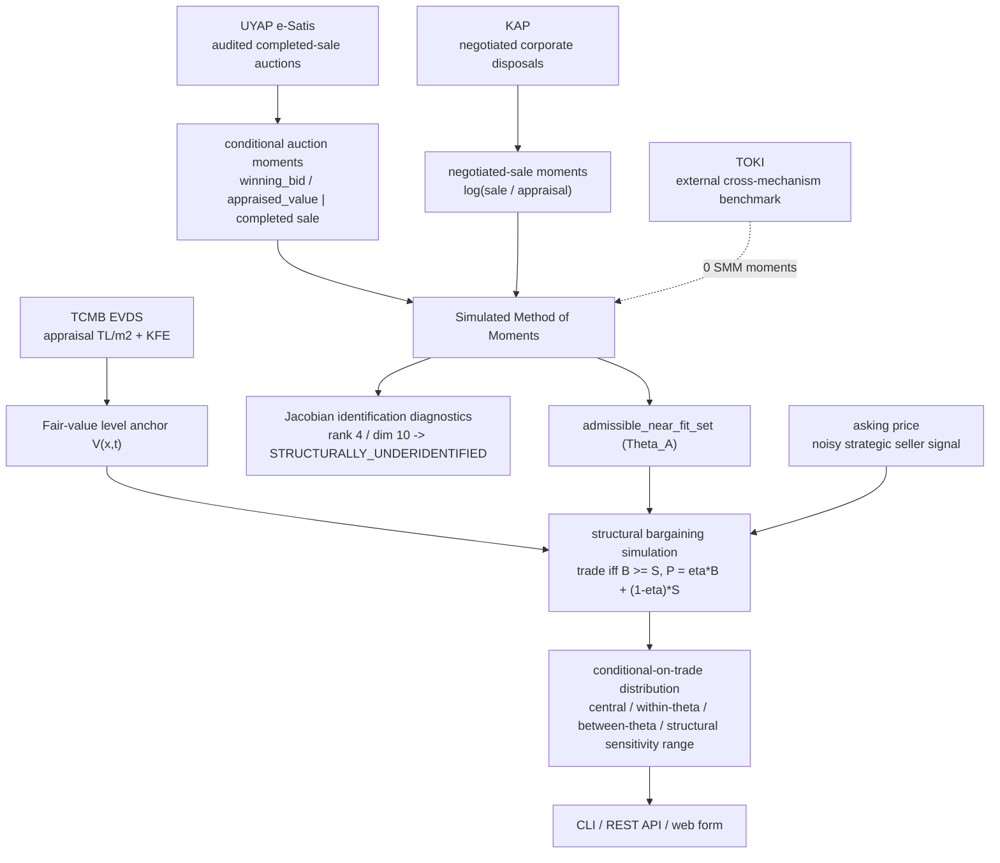

# sold

[](https://github.com/onatozmenn/sold/actions/workflows/ci.yml)
[](https://github.com/onatozmenn/sold/actions/workflows/kfe-refresh.yml)
[](https://www.python.org/)
[](LICENSE)
[](tests/)
[](#provenance-audited-public-structural-evidence)

> A **mechanism-aware structural econometric prototype** that infers a **structural transaction-price distribution** for a Turkish home from an **asking-price signal** and public economic evidence.

**sold** does **not** observe the actual ordinary-resale closing price — no source publishes it in Türkiye. Instead it treats ordinary negotiated resale as **generalized Nash bargaining** and calibrates the structural parameters to **source-specific public moments** by Simulated Method of Moments (SMM). Concretely:

- The actual ordinary-resale closing price **is not observed**; the output is an inferred distribution, never an observed, actual or true sale price.
- **TCMB** provides the **fair-value level anchor** (appraisal TL/m²), not transactions.
- Genuine **audited UYAP completed-sale auctions** and **KAP negotiated corporate disposals** provide **source-specific structural moments**.
- **TOKİ** is an **external cross-mechanism benchmark**, not an SMM moment source.
- The current **local Jacobian rank is 4** for a **ten-dimensional** structural primitive vector, so the identification status is **`STRUCTURALLY_UNDERIDENTIFIED`**.
- Prediction sensitivity is evaluated across the **`admissible_near_fit_set` (`Θ_A`)** and across documented bounds for fixed structural assumptions; every transaction-price distribution is **`conditional_on_trade`** (`B ≥ S`).
- The reported **structural sensitivity range is not a confidence interval** and carries **no frequentist coverage claim**.

No fabricated data is ever served, and the system never reports a measured ordinary-resale prediction accuracy.

## Table of Contents

- [Background](#background)
- [How It Works](#how-it-works)
- [Structural inference engine](#structural-inference-engine)
- [Provenance-Audited Public Structural Evidence](#provenance-audited-public-structural-evidence)
- [UYAP Evidence Ingestion Pipeline V1](#uyap-evidence-ingestion-pipeline-v1)
- [Optional direct-label validation channel](#optional-direct-label-validation-channel)
- [Data Sources](#data-sources)
- [Install](#install)
- [Usage](#usage)
- [Automation](#automation)
- [Project Structure](#project-structure)
- [Testing](#testing)
- [Methodology & References](#methodology--references)
- [Roadmap](#roadmap)
- [Legal & Ethics](#legal--ethics)
- [Contributing](#contributing)
- [License](#license)
- [Acknowledgements](#acknowledgements)

## Background

### The problem

In the United States, MLS "sold data" makes transaction prices transparent. Türkiye has no equivalent:

- **Title deeds (Tapu)** record declared values that are systematically understated to reduce transfer tax.
- **No MLS** — no system publishes the price a home actually sold for.
- **Listing portals** expose only the **asking** price.

So the ordinary-resale closing price is genuinely unobserved, and any model trained naively on listings is biased.

### The approach

`sold` does **not** learn an asking→closing gap from supervised labels, and it does **not** fall back to a published city negotiation margin. Instead it **infers a structural transaction-price distribution** from an economic model of negotiated resale. Ordinary resale is modeled as **generalized Nash bargaining**:

- `B` = buyer valuation
- `S` = seller reservation value
- trade occurs **iff `B ≥ S`**
- the closing price is `P = η·B + (1 − η)·S`, where `η` (seller bargaining power) is **estimated, never hard-coded**

The **asking price is a noisy strategic seller-side signal** of the seller reservation — it is **not** ground truth and **not** a ceiling. Public sources enter the model through **source-specific structural moments under their own mechanism** — never pooled as ordinary-resale labels. All ten structural primitives remain in the bounded near-fit search; identification and prediction sensitivity are reported honestly (the current fit is **structurally underidentified**).

## How It Works



The pipeline has **no fixed-margin fallback**, **no supervised asking→closing head**, and **no automatic ML takeover**. Fair value is a TCMB-anchored **level**; the two genuinely-observed public mechanisms (UYAP completed auctions, KAP negotiated disposals) contribute **source-specific moments** to SMM; TOKİ is held aside as an **external benchmark**; and every price output is a **`conditional_on_trade` structural distribution**, never an observed closing price.

### Structural components

The core lives in [`src/sold/structural/`](src/sold/structural/). Each module maps to one part of the model and is **frozen**:

| Module | Structural role |
|---|---|
| [`params.py`](src/sold/structural/params.py) | The structural parameter vector `θ` and its transforms (bounds, packing, defaults) |
| [`bargaining.py`](src/sold/structural/bargaining.py) | Generalized Nash bargaining: draw `B`, `S`; trade iff `B ≥ S`; `P = η·B + (1−η)·S` |
| [`hedonic.py`](src/sold/structural/hedonic.py) | TCMB-anchored fair-value level `V(x, t)` (relative premiums only; no listing intercept as level) |
| [`auction.py`](src/sold/structural/auction.py) | UYAP completed-sale auction mechanism and its **conditional-on-completed-sale** moments |
| [`kap.py`](src/sold/structural/kap.py) | KAP negotiated-disposal `log(sale/appraisal)` moments (currency/VAT normalization) |
| [`toki.py`](src/sold/structural/toki.py) | TOKİ cumulative-disclosure differencing → external cross-mechanism benchmark cohorts |
| [`moments.py`](src/sold/structural/moments.py) | Observed vs simulated moment vectors and the weighting matrix `W` |
| [`smm.py`](src/sold/structural/smm.py) | Simulated Method of Moments objective + numpy-only Nelder-Mead minimizer |
| [`identify.py`](src/sold/structural/identify.py) | Numerical moment-Jacobian identification diagnostics (rank, condition, profiles) |
| [`partial.py`](src/sold/structural/partial.py) | `admissible_near_fit_set` (`Θ_A`), tolerance sensitivity, cumulative search-stability study |
| [`predict.py`](src/sold/structural/predict.py) | Identification-aware, `conditional_on_trade` prediction over `Θ_A` |
| [`datasets.py`](src/sold/structural/datasets.py) | Genuine audited evidence loader (`source_audited`, kept apart from fixtures) |

#### The structural parameter vector `θ`

`θ` contains **ten structural primitives** and is exactly the bounded free set in [`params.py`](src/sold/structural/params.py) (`DEFAULT_FREE`, `dim(θ) = 10`). The four observed moments do not uniquely estimate this vector; the code therefore reports a bounded near-fit sensitivity set rather than a point estimate:

| Free parameter | Meaning |
|---|---|
| `mu_b` | Buyer-valuation location (log, relative to fair value) |
| `sigma_b` | Buyer-valuation dispersion (log) |
| `mu_s` | Seller-reservation location (log, relative to fair value) |
| `sigma_s` | Seller-reservation dispersion (log) |
| `eta` | Seller bargaining power `η ∈ (0, 1)` in `P = η·B + (1−η)·S` |
| `auction_shift` | UYAP forced-sale / auction buyer-valuation shift (log) |
| `arrival_rate` | UYAP bidder-arrival intensity |
| `tightness_beta` | Market-tightness loading |
| `kap_shift` | KAP corporate-mechanism shift |
| `asking_signal` | Asking-to-seller-reservation signal weight |

All ten enter the reported structural sensitivity analysis. `tightness_beta` at the zero-tightness calibration context and `asking_signal` in public-source calibration are exact null directions; their documented endpoint sensitivity is included explicitly in the product price range.

## Structural inference engine

Convergence of the optimizer is **not** identification, so the engine separates estimation, identification diagnostics, and prediction sensitivity.

**Estimation.** The ten-dimensional `θ` is searched by Simulated Method of Moments against the genuinely-observed public moments:

$$\hat\theta = \arg\min_\theta\; (m_{obs} - m_{sim}(\theta))' \, W \, (m_{obs} - m_{sim}(\theta))$$

Only **two** public mechanisms enter the SMM moment vector, under their own mechanism, never pooled as ordinary-resale labels:

| Source | Structural role | In SMM? |
|---|---|---|
| **UYAP** e-Satış | **Audited completed-sale auction evidence** — `winning_bid / appraised_value`, evaluated **conditional on a completed sale**. `muhammen_bedel = appraised value Q` (never a reserve or exact statutory floor). The public UYAP outcome taxonomy does not currently identify a comparable negative auction trade class, so no `uyap_sale_prob` moment is used. | ✅ moments |
| **KAP** | Non-related **negotiated corporate disposals** → moments over `log(sale / appraisal)`, with currency/VAT normalization at documented TCMB EVDS rates. Helps jointly calibrate `η` and the corporate mechanism shift (KAP does *not* "give `η`"). | ✅ moments |
| **TOKİ** | `external_cross_mechanism_benchmark` — genuine cumulative-disclosure cohort/composition moments that are **observed but held outside SMM** (`moments_used_in_identification = 0`, `rank(J_TOKİ) = 0`). No primary-market mechanism was invented to force a rank. | ❌ external only |

The **four** SMM moments currently in `m_obs` are:

1. `uyap_win_over_appraisal_mean`
2. `uyap_win_over_appraisal_sd`
3. `kap_log_ratio_mean`
4. `kap_log_ratio_sd`

**Five** genuine TOKİ external-benchmark moments are observed, but **zero** enter the current SMM objective — the simulator has **no primary-market mechanism** to produce a model-implied counterpart for them. UYAP, KAP and TOKİ records are **never** converted into synthetic ordinary-resale `asking → closing` ground truth.

**Identification.** `sold structural identify` computes a numerical moment Jacobian `J(θ) = ∂m_sim/∂θ'` (central differences, common random numbers) **restricted to genuinely-observed moments**, and reports per-source Jacobian ranks, singular values, condition number, weak and exact-null directions, and per-parameter profiles. The current fit has **`rank(J) = 4`** for **`dim(θ) = 10`**, so the reported status is:

> **`identification_status = STRUCTURALLY_UNDERIDENTIFIED`** (an econometric statement about the moment structure — `rank(J) < dim(θ)`).

Because the model is underidentified, prediction runs in **sensitivity mode** across the **`admissible_near_fit_set` (`Θ_A`)**, defined as *the set of economically admissible structural parameter vectors whose SMM criterion lies within the documented near-fit tolerance of the best observed-moment fit*. `Θ_A` is explicitly **not** a formally estimated identified set, **not** a confidence region, and **not** a set with nominal coverage; it is an admissible near-fit region used only to expose parameter sensitivity.

Partially observed UYAP legal floors are treated as interval-censored thresholds between the known statutory lower bound and the observed completed-sale price; they are never substituted as exact reserves. **Search stability is reported separately from identification, and never conflated with it.** The numerical coverage of `Θ_A` by the descent-based sampler is a distinct question from econometric identification. The accepted cumulative, incumbent-preserving, common-threshold experiment preserves the global incumbent as the search budget grows, so `cumulative_best_objective` **is monotone non-increasing** across increasing budgets. Its current diagnostic is:

> **`near_fit_search_stability = INSUFFICIENT_COVERAGE`** — after enforcing a fixed four-moment objective for every candidate, the current bounded cumulative search still expands the accepted support. This is a **numerical search-coverage** statement only. It is separate from econometric identification: the model remains `STRUCTURALLY_UNDERIDENTIFIED` (`rank(J) = 4 < dim(θ) = 10`).

The current structural moments pool audited residential, commercial and land records because the KAP sample is too small to support a four-moment property-type-specific calibration. The API therefore exposes this honestly as mixed-property structural evidence and does not accept a `property_type` selector that would falsely imply type-specific estimates.

**Prediction semantics.** For an ordinary listing, the asking price conditions the seller reservation; `B`/`S` are drawn; trades (`B ≥ S`) are retained; and a **`conditional_on_trade`** closing distribution is returned.

> The transaction-price distribution is computed **conditional on the structural simulation producing trade, `B ≥ S`**. It is **not** an unconditional expected sale outcome.

The prediction fields are:

| Field | Meaning |
|---|---|
| `price_estimate_condition` | Always `conditional_on_trade` — the estimate is a price *given a sale occurs*, never an unconditional/observed closing price |
| `central_structural_estimate` | Central estimate from a single deterministic **representative trading near-fit configuration** (lies inside its own interval by construction) |
| `within_theta_negotiation_interval` | Bargaining dispersion **at a fixed `θ`** (buyer/seller heterogeneity) |
| `between_theta_near_fit_band` | Movement of the central estimate **across `Θ_A`** (parameter sensitivity) |
| `structural_sensitivity_range` | The combined envelope — a **structural sensitivity range, not a confidence interval**, with no frequentist coverage |
| `simulated_trade_share_band` | The **model-implied Monte-Carlo share** of simulated draws satisfying `B ≥ S`. It is `not_empirically_calibrated_to_observed_uyap_no_trade_outcomes` — **not** a probability of sale, a sale likelihood, or an empirically estimated trade probability |

No prediction ever returns a `confidence_interval` or an `accuracy` field.

## Provenance-Audited Public Structural Evidence

`sold` builds provenance-audited structural evidence from official public records, and **how a record reaches the parser is source-specific**:

- **TCMB / TÜİK** market-anchor series are fetched automatically through the official **EVDS** API.
- **UYAP** has a **browser-assisted, provenance-aware acquisition pipeline** (below): inside a **user-controlled, manually authenticated session** it can help locate the target record, collect the official row-local artifacts, and download the native `.udf` documents. Authentication stays manual and admission stays an explicit operator step.
- **KAP** and **TOKİ** evidence is added by **manual audit** of the official public records; they do **not** use the UYAP browser collector.

In every case the parser normalizes only non-personal fields. This is **not** an official API integration and **not** unattended continuous scraping.

Each source has a distinct, non-pooled structural role:

| Source (`domain`) | Structural role | Enters SMM? |
|---|---|---|
| **UYAP** e-Satış | Audited completed-sale auction moments (`winning_bid / appraised_value` \| sale) | ✅ SMM moments |
| **KAP** | Non-related negotiated corporate-disposal moments (`log(sale/appraisal)`) | ✅ SMM moments |
| **TOKİ** | `external_cross_mechanism_benchmark` cohort moments | ❌ observed, outside SMM |
| **consumer** (direct label) | Optional self-reported validation channel | ❌ **frozen**, outside SMM |

The **SMM moment vector uses exactly four moments** (two UYAP, two KAP). TOKİ and the consumer channel are deliberately **excluded** from identification.

> **Evidence expansion batches.** Genuine audited records are admitted in explicit batches under a predeclared selection rule (e.g. *UYAP Evidence Expansion Batch 1* added five audited completed-sale auctions, bringing the genuine UYAP total to 7). Each admitted UYAP record uses the official **İhale Bedeli** over the audited appraisal `Q` — never a deposit-adjusted, ownership-share, creditor-setoff, or KDV-adjusted amount. Audited-but-non-terminal records are preserved as excluded candidates in [`validation/structural/uyap_candidates.json`](validation/structural/uyap_candidates.json) (mirroring the KAP-candidate manifest); they never enter the genuine set, the SMM moments, or any negative-class construction (`uyap_sale_prob` is never created). Current genuine counts are reported by `sold structural dataset` (separate from fixtures), not hardcoded here.

### Three levels of validation, kept distinct

1. **Parser / adapter validation** — unit tests confirm each parser maps fields to the schema on **illustrative fixtures**. ✅ done.
2. **Real-record validation** — the operator downloads one real official record per source, feeds its non-personal fields through the parser, and commits the **manually-audited expected output** (never the raw artifact) under [`validation/`](validation/). Tests then enforce `parser output == audited expectation`. The genuine audited structural seed lives under [`validation/structural/`](validation/structural/) (`source_audited = true`), strictly separate from fixtures.
3. **Browser-assisted UYAP acquisition** — inside a user-controlled authenticated session, the UYAP pipeline can discover the target record and collect its official native `.udf` artifacts (see below). ✅ Live-proven on the pilot record and a bounded five-record Ankara validation batch. Broad, unattended or continuous ingestion remains out of scope and is not built.

> Level-1 **illustrative fixtures** (e.g. [samples/labels/illustrative_kap.json](samples/labels/illustrative_kap.json)) use invented placeholder values to exercise the parser. Level-2 **genuine audited** records live separately and drive the structural moments. The two tiers are kept strictly separate and never conflated.

### Domains are never pooled

- UYAP and KAP enter SMM **only** through their own source-specific moments — never merged into a single asking→closing target.
- TOKİ cohort moments are observed but **held outside** the SMM system (external benchmark).
- The consumer direct-label channel is **frozen** and never contributes to SMM.
- `sold structural dataset` reports the genuine audited counts per source **separately** from fixtures, demo data, and near-fit search candidates.

## UYAP Evidence Ingestion Pipeline V1

A **provenance-aware data-acquisition subsystem** ([`src/sold/ingestion/uyap/`](src/sold/ingestion/uyap/)) that reduces the manual work of discovering, collecting, extracting, auditing, reviewing, and admitting UYAP e-Satış completed-sale evidence. It is **not** a new methodology or pricing mechanism and does **not** modify the frozen structural core; admission writes to the existing genuine UYAP schema and preserves the UYAP P/Q moment definition.

**Workflow.** `discovery → collection → extraction → same-asset reconciliation → rule-based completed-sale audit → human review → explicit admission → existing UYAP evidence schema`. Extraction is deterministic (no ML, no weak supervision, no classifier); each field is traceable to the artifact it came from. **Audit is not admission** — a parser never writes genuine `uyap.json` directly; admission is a separate, explicit, idempotent operator action that validates the existing schema and dedupes by `public_record_id`.

**Completed-sale admission rule** (formalizing the seven genuine observations + Batch 1): a candidate is admissible only with (A) an auditable appraisal `Q` for the same asset, (B) an **explicit official İhale Bedeli**, and (C) terminal completed-sale evidence (`Satıldı` / `Satış İşlemleri Tamamlandı`). The **auction-price numerator is always the explicit İhale Bedeli** — never the *Ödenmesi Gereken Bedel*, deposit-adjusted balance, ownership-share settlement, creditor-setoff, or KDV-adjusted amount; KDV never adjusts `P` or `Q`; `ALACAĞA MAHSUBEN` never invalidates an explicit İhale Bedeli. Non-terminal records (e.g. `Birinci Alıcıya Süre Verildi`) become `EXCLUDED_NON_TERMINAL` in [`validation/structural/uyap_candidates.json`](validation/structural/uyap_candidates.json) — never admitted, never a negative sale-probability observation (`uyap_sale_prob` is never created). Ambiguous candidates (missing appraisal / missing explicit İhale Bedeli / missing terminal evidence / reconciliation ambiguity) are surfaced to a **human-review queue** with the exact blocking reason and are never silently promoted.

**Browser-assisted, not authentication-bypassing.** The optional browser collector (Playwright, `pip install -e ".[browser]"`) operates **only within a user-controlled, already-authenticated or public session** (attach to a browser you launched via a CDP endpoint, or a local profile you signed into yourself). It **never** automates e-Devlet login, MFA or CAPTCHA, never bypasses access controls, and never stores credentials, cookies, session tokens, or browser profiles in the repository (raw artifacts and profiles live under gitignored `data/`). If a live browser is unavailable, the **manual artifact-import** path (saved HTML/PDF/text) is the fallback.

**Privacy.** Only non-personal institution / official file identifier / property / economic / public-record fields are retained. Party, debtor, creditor, counsel, and personal identifiers (names, TC IDs, phones, IBANs, accounts) are never propagated into normalized extraction or analytical records.

```bash
sold uyap discover --institution "Ankara ... Satış Memurluğu" --file-id "2026/43 Satış"
sold uyap import-artifacts --candidate-id <id> --type auction_result --path saved_result.html
sold uyap extract  --candidate-id <id>      # deterministic fields (not admission)
sold uyap audit    --candidate-id <id>      # rule-based completed-sale audit (not admission)
sold uyap review                            # human-review queue with blocking reasons
sold uyap admit    --candidate-id <id>      # EXPLICIT, idempotent admission to uyap.json
sold uyap status                            # discovered / audited / admissible / admitted
```

### Fast 81-province campaign

Authenticate once in the dedicated user-controlled Chrome window, leave **İhaleler → Geçmiş İlanlar**
open, then run two resumable phases. Dates are optional; discovery defaults to the latest seven days and
one outstanding window per province:

```powershell
# Phase 1: metadata-only scan across all 81 provinces (no document download)
sold uyap campaign --all-provinces --phase discover `
  --cdp-endpoint http://127.0.0.1:9222

# Phase 2: revisit only windows containing new/incomplete candidates and download only queued KAYIT NOs
sold uyap campaign --all-provinces --phase acquire `
  --cdp-endpoint http://127.0.0.1:9222
```

For bounded historical backfill, increase the per-province budget gradually; completed discovery and
acquisition checkpoints are independent, so rerunning the command advances rather than starting over:

```powershell
sold uyap campaign --all-provinces --phase discover `
  --date-from 2025-01-01 --date-to 2026-07-10 `
  --max-windows-per-province 4 `
  --cdp-endpoint http://127.0.0.1:9222
```

The campaign is faster without weakening provenance:

- provinces with measured sold-card yield run first; cold start prioritizes İstanbul, Ankara, İzmir, etc.;
- newest windows run first and completed phase-specific checkpoints are skipped;
- a discovery page performs one locked candidate-store write instead of one full rewrite per card;
- click-scoped, date-bound response evidence prevents stale AJAX cards or zero banners from being attributed
  to the next province/window;
- windows at the 200-result boundary split automatically; unsplittable saturated days remain explicit blockers;
- page coverage and parsed-card cardinality must match source metadata before a window can become complete;
- acquisition scans only queued windows and binds each KAYIT NO to its discovered candidate identity;
- elapsed time, throughput, split counts, deferred work and unresolved blockers are reported.

Document modals remain serial inside one authenticated page. Parallel clicks/downloads on that shared DOM
would risk cross-row artifact binding; the campaign gains throughput by eliminating redundant work instead.
Bounded runs are intentionally resumable: deferred, saturated, truncated, stale, failed or cardinality-mismatched
work is never reported as complete and returns a nonzero status for automation. Neither phase admits evidence:
`sold uyap review` and explicit `sold uyap admit` remain separate.

> **Nationwide live run (2026-07-11).** A manually authenticated, user-controlled Chrome session completed
> metadata discovery for **81/81 provinces** over `2026-07-05..2026-07-11`: **535 source result cards** and
> **3 terminal `Satıldı` candidates**. Candidate-bound native acquisition completed **3/3** (Erzincan 2,
> Sakarya 1), leaving **0 queued candidates and 0 blockers**. Audit outcomes were one new
> `ADMISSIBLE_COMPLETED_SALE` and two `PENDING_REVIEW`; **no record was admitted automatically**. The live
> adapters bind search results to exact AJAX response/cardinality and document actions to exact KAYIT,
> response URI, modal row and action fingerprint.

> **Live status.** UYAP Live Browser Pilot 1 reached **`PASS`** on the real **2026/263 Esas** record. A later bounded Ankara batch (`2026-06-18..2026-06-24`) collected five terminal-sale cards through native UDF artifacts: two new records were explicitly admitted, two were identified as existing observations (one primary ID and one alias), and one remains blocked for human review. This is **not** an official API, does **not** automate authentication, is **not** unattended continuous ingestion, and does **not** prove universal layout coverage. The automated test suite remains fully offline.

### UYAP Live Browser Pilot 1 (live verification)

A **non-mutating verification** workflow that checks, end to end, whether the pipeline can collect the already-known completed-sale record **2026/263 Esas** through a **user-controlled browser session** and reproduce its manually audited truth (`appraisal 6,800,000`, `İhale Bedeli 5,715,000`, `P/Q 0.8404411764705882`, `ADMISSIBLE_COMPLETED_SALE`). Because **2026/263 is already admitted**, the pilot **never** admits it again: the genuine UYAP count stays **7** and `uyap.json` is unchanged (a mutation guard fingerprints the file SHA256, the count, and the four-moment SMM vector before and after). e-Devlet authentication is always **manual**; the pilot only attaches to a session you launched and signed into yourself, and the CLI never logs in for you.

**Result: one live-proven `PASS`.** After fourteen real interoperability-fix runs, the fifteenth real live run reached `pilot_outcome = PASS` (`verification_layer_result = PASS`). Both `auction_result` and `sale_notice` were collected through the **official row-local native `.udf` download path**: for each, the unique DocumentRow was reacquired by recognized identity, the same-row download action was ownership-validated, a real browser download event produced the exact official `.udf` bytes, the ZIP container was validated, `content.xml` was parsed safely, the document type was corroborated, and the **existing deterministic extractor** independently recovered the required fields.

| Field | Live-reproduced value |
|---|---|
| `extracted_auction_price` (explicit İhale Bedeli) | `5715000.0` (one candidate) |
| `extracted_appraisal` (Muhammen Bedel) | `6800000.0` (one candidate) |
| `p_over_q` | `0.8404411764705882` |
| `alacaga_mahsuben` / `kdv_rate` | `true` / `20.0` |
| same-asset reconciliation | `reconciled` (ada, parsel, floor, section_no) |
| audit | `ADMISSIBLE_COMPLETED_SALE` |
| mutation guard | `uyap.json` SHA256 unchanged during the live pilot; the subsequently expanded genuine set now contains 20 records |

No OCR, ML, weak supervision, or known-truth injection is used at any stage; no e-Devlet login, MFA, or CAPTCHA is automated; no credentials, cookies, tokens, or browser profiles are committed; and the pilot never calls `admit`. This is **one** live PASS on **one** known record: it demonstrates interoperability for that record, not production readiness or universal UYAP compatibility.

**Native UDF source path.** For the live-verified document format, a UYAP `.udf` is a **ZIP-compatible container** with a root `content.xml`. The collector reads the native artifact safely (no `extractall`, path-traversal members rejected, bounded decompressed size), validates the container, parses the XML **without external-entity or network behaviour**, takes the `content` element text/CDATA, **corroborates the requested document type** (a mismatched type is preserved for diagnostics but never promoted as evidence), and feeds the text into the existing deterministic extractor. The exact native bytes are kept only in **gitignored** artifact storage. This describes the supported native format **observed and live-verified by the pilot**, not a guarantee that every possible UYAP `.udf` uses the same layout.

**Outcome semantics.** `PASS` (real live session reached, required evidence extracted, reconciliation passed, audit `ADMISSIBLE_COMPLETED_SALE`, known-truth matched, and `uyap.json` remained byte-unchanged during that run); `PARTIAL` (live session worked but a required artifact/parser path was unsupported, reconciliation ambiguous, or terminal evidence not collected); `FAIL` (a real live run produced incorrect required evidence or an incorrect audit decision); `NOT_RUN` (no real user-controlled UYAP browser session was available). Offline regression success does **not** convert `NOT_RUN` into `PASS`.

**Live milestone summary** (the detailed Fix 1 to Fix 14 chronology lives in [docs/DEVELOPMENT_HISTORY.md](docs/DEVELOPMENT_HISTORY.md)):

| Stage | Runs | Live result |
|---|---|---|
| Browser interoperability | 1 to 5 | Resolved page-state, target-card, and document-list detection |
| Row / action + viewer | 6 to 9 | Resolved logical-row and view/download action semantics; measured the UDF viewer lifecycle |
| Deterministic text extraction | 10 to 11 | Proved official text and appraisal extraction; exposed result-field serialization |
| Native UDF path | 12 to 14 | Discovered the ZIP/`content.xml` UDF format, fixed cross-row misbinding, live-proved the auction-result native path |
| Final pilot | 15 | `PASS`: both `auction_result` and `sale_notice` native paths succeeded; extraction, reconciliation, audit, verification, and the mutation guard all passed |

Windows operator workflow (PowerShell; adjust the Chrome path for your machine):

```powershell
# 1) install the optional browser extra
pip install -e ".[browser]"; python -m playwright install chromium

# 2) start Chrome with remote debugging and a DEDICATED non-repo profile (sign in yourself in this window)
& "C:\Program Files\Google\Chrome\Application\chrome.exe" --remote-debugging-port=9222 --user-data-dir="$env:LOCALAPPDATA\uyap_pilot_profile"

# 3) in that Chrome window: authenticate to e-Devlet/UYAP yourself, then open the real UYAP e-Satis
#    search/listing page and leave the 2026/263 Icra card visible. Do NOT open the document modal or detail,
#    and close any stale UDF viewer tabs.

# 4) run the non-mutating pilot (never logs in for you, never admits, never fabricates)
sold uyap pilot --cdp-endpoint http://127.0.0.1:9222

# 5) inspect the JSON report (gitignored runtime artifact)
Get-Content data\ingestion\uyap\pilot_report.json
```

The dedicated profile lives **outside** the repository; browser profiles, cookies, tokens, and the pilot report are gitignored and never committed.

## Optional direct-label validation channel

Separately from the structural evidence above, `sold` retains a **frozen** listing-outcome channel that lets a broker or seller record the *outcome* of a listing and receive simple **non-ML negotiation analytics** in return. This channel is **not** part of the structural model:

- It contributes **no moments to SMM** and calibrates **no `SaleProbability` / `ClosingDiscount` model** — no supervised asking→closing head is trained.
- Outcomes (`sold` · `withdrawn` · `expired` · `active` · `lost_to_other` · `unknown`) and their analytics (counts, discount summaries) are descriptive only; a delisting is never assumed to be a sale.
- Genuine self-reported submissions are kept **strictly separate** from fixtures, demo data, and test data by an origin/quality gate. The current genuine direct-label count is **0**.

```bash
sold flywheel record sold --province İstanbul --last-asking 3200000 \
     --sold-price 2900000 --price-cuts 1 --days-to-close 40
sold flywheel analytics
```

Equivalent REST endpoints `POST /outcome` and `GET /analytics` are retained as a legacy/optional surface. This channel is a possible **future validation** source for the structural model, not an input to it.

## Data Sources

Sources play **four distinct roles** and are never pooled into a single training target.

**1. Market anchors (official automated market data).** Fetched from the official **TCMB EVDS** API and refreshed automatically; nothing is scraped. These provide the fair-value **level anchor** and market context, not transactions:

| Dataset | Source | Meaning | Coverage |
|---|---|---|---|
| `datasets/kfe.csv` | TCMB | Residential Property Price Index (trend / rolling) | 2010 → now, monthly |
| `datasets/unit_prices.csv` | TCMB | Appraisal-based unit prices (TL/m²) | 2013 → now, quarterly, 77 provinces |
| `datasets/house_sales.csv` | TÜİK via EVDS | House sales counts (demand / liquidity context) | 2013 → now, monthly, by province |

**2. Structural evidence (manually-audited public official records).** Genuine, operator-audited **UYAP** completed-sale auctions and **KAP** negotiated corporate disposals under [`validation/structural/`](validation/structural/) (`source_audited = true`). These supply the **four SMM moments**; they are hand-audited from official records, never bulk-scraped.

**3. External benchmark.** Genuine **TOKİ** cumulative-disclosure cohorts — observed and available, but **outside** the SMM system (`external_cross_mechanism_benchmark`).

**4. Frozen optional validation channel.** The consumer/broker direct-label channel (see [Optional direct-label validation channel](#optional-direct-label-validation-channel)) and the legacy `datasets/ground_truth.csv` are **optional** and **not** part of the structural model. `datasets/ground_truth.csv` is a **legacy** user-provided file retained for the legacy `sold model` / `sold ground-truth` paths only.

> No unauthorized scraping is performed. Automated fetching is limited to official EVDS market series; structural evidence is added by manual audit of official public records. Title-deed *declared* values are **not** treated as consideration, and the system never claims to observe the actual ordinary-resale closing price.

## Install

**Prerequisites:** Python 3.11+ and a free [TCMB EVDS API key](https://evds2.tcmb.gov.tr) (only required to refresh data yourself).

```bash
git clone https://github.com/onatozmenn/sold.git
cd sold

python -m venv .venv
source .venv/bin/activate          # Windows: .\.venv\Scripts\Activate.ps1

pip install -e ".[dev]"            # optional extras: .[model] .[api] .[postgres]
cp .env.example .env               # then set EVDS_API_KEY in .env
```

## Usage

The primary workflow is the **structural** command group over the frozen econometric core.

### Inspect the genuine structural evidence

```bash
sold structural dataset      # genuine audited UYAP / KAP / TOKİ counts, separate from fixtures
```

### Check identification before trusting any estimate

```bash
sold structural identify     # numerical moment-Jacobian: rank, condition, weak directions
                             # → STRUCTURALLY_UNDERIDENTIFIED (rank 4 / dim 10)
sold structural partial      # admissible_near_fit_set (Θ_A) + tolerance sensitivity
```

### Produce a structural, identification-aware price distribution

```bash
sold structural value 3200000 --province İstanbul --gross-m2 120 --partial
```

Output is an explicitly **`conditional_on_trade`** structural sensitivity range (central estimate, within-θ interval, between-θ near-fit band, combined structural sensitivity range) — **never** an observed closing price and **never** a confidence interval.

### Run the web app / REST API

```bash
sold serve            # → http://127.0.0.1:8000
```

Structural endpoints over the frozen core:

| Method | Endpoint | Returns |
|---|---|---|
| `POST` | `/structural/valuate` | Identification-aware `conditional_on_trade` structural distribution (machine-readable) |
| `GET`  | `/structural/evidence` | Model Evidence: genuine public structural counts (separate from fixtures/tests) |
| `GET`  | `/structural/method` | Method overview: anchor → moments → SMM → `Θ_A` → sensitivity |
| `GET`  | `/structural/stability` | Cumulative near-fit search-stability diagnostic |

### Refresh the market-anchor data (requires `EVDS_API_KEY`)

```bash
sold evds kfe          --out datasets/kfe.csv
sold evds house-sales  --out datasets/house_sales.csv
sold evds unit-prices  --out datasets/unit_prices.csv
```

### Legacy and experimental paths

These predate the structural pivot and are retained only for reference — they are **not** the active methodology:

```bash
sold model value 3200000 --province İstanbul --gross-m2 120   # legacy fixed-anchor baseline
sold model demo                                               # ML-method self-test on simulated data
sold gt analyze                                               # legacy ground-truth analytics
sold flywheel analytics                                       # frozen optional validation channel
sold structural estimate                                      # SMM method-validation demo (not a real fit)
```

The legacy `POST /valuate`, `POST /outcome`, and `GET /analytics` endpoints remain available for these paths.

## Automation

Three GitHub Actions keep the project alive without your machine:

| Workflow | Trigger | Action |
|---|---|---|
| `kfe-refresh.yml` | weekly + manual | Pulls KFE, house sales, and unit prices; commits the updated CSVs |
| `report.yml` | on label change + weekly | Regenerates `datasets/report.md` |
| `ci.yml` | every push / PR | Runs the test suite |

Set the `EVDS_API_KEY` repository secret (Settings → Secrets and variables → Actions) to enable data refresh.

## Project Structure

```
src/sold/
  config.py          # settings (.env)
  structural/        # FROZEN core: params, bargaining, hedonic, auction, kap, toki,
                     #   moments, smm, identify, partial, predict, datasets
  api/               # FastAPI service: structural endpoints + structural_product assembly
  evds/              # TCMB EVDS client: KFE, house sales, unit prices
  features/          # demand signal (market context) + feature builder
  model/             # legacy valuation / estimator / synthetic (method self-test)
  groundtruth/       # legacy ground-truth loading + analysis
  labels/            # provenance registry + per-source parsers + aggregate observations
  flywheel/          # frozen optional direct-label validation channel
  consumer/          # frozen consumer submission path + quality gate
  scraper/           # ToS-respectful local-example pipeline (no live scraping)
  ingestion/uyap/    # UYAP evidence ingestion V1 (discovery→audit→explicit admission)
  tuik/              # TÜİK client
  db/                # SQLAlchemy models + schema
  cli.py             # `sold` command-line interface (incl. `sold structural ...`)
validation/
  structural/        # GENUINE audited structural seed (source_audited=true)
  real_records/      # manually-audited parser expectations (KAP / TOKİ / UYAP)
datasets/            # market-anchor data (auto-refreshed) + legacy ground_truth.csv
docs/                # DEVELOPMENT_HISTORY.md (superseded + frozen milestones)
scripts/             # helper scripts (data fetch, report)
tests/               # offline unit / end-to-end tests
```

## Testing

```bash
pytest -q             # 827 tests, fully offline (no network or API key required)
```

The automated suite is fully offline. The **UYAP live browser pilot is a separate, operator-run verification** (a real user-controlled session against the live site) and is **not** part of the offline CI suite.

## Methodology & References

The methodology is a **structural econometric** one; the following foundations describe *what the code implements*, not a claim of published validation of this specific prototype:

- **Generalized Nash bargaining** — the closing price `P = η·B + (1 − η)·S` with trade iff `B ≥ S`, and `η` estimated rather than assumed.
- **Simulated Method of Moments (SMM)** — parameters fit by minimizing a weighted distance between observed and simulated moments; used because the ordinary-resale closing price is unobserved.
- **Housing search-and-bargaining models** — the economic framing of buyer/seller valuations, market tightness, and negotiated trade.
- **Local (moment-Jacobian) identification** — assessing identification numerically via the rank/conditioning of `∂m_sim/∂θ'`, and reporting structural underidentification honestly (`rank(J) = 4 < dim(θ) = 10`).
- **Set / near-fit sensitivity analysis** — reporting an admissible near-fit region (`Θ_A`) and prediction sensitivity across it, explicitly *not* a confidence region.
- **Cumulative, incumbent-preserving numerical-search diagnostics** — a common-threshold search-coverage study kept **separate** from econometric identification; `cumulative_best_objective` is monotone non-increasing across increasing budgets, and the corrected four-moment diagnostic currently reports `near_fit_search_stability = INSUFFICIENT_COVERAGE`.
- **Appraisal-anchored (hedonic) fair value** — using TCMB appraisal levels as the fair-value anchor, with relative characteristic premiums only.
- **Source-specific mechanism moments** — UYAP completed-sale auctions and KAP negotiated corporate disposals contribute moments under their own mechanism; TOKİ is an external cross-mechanism benchmark.

> A formal, page-verified bibliography for these foundations is **future documentation work**; specific citations are intentionally not listed here rather than fabricated.

## Roadmap

The structural and prediction-semantics core is frozen. One bounded, reviewed evidence-expansion batch and its structural re-audit are complete; future work remains bounded and explicitly reviewed, never unattended ingestion.

- [x] Run a bounded five-record UYAP validation batch through the live browser/native-UDF path and preserve exact blocking reasons
- [x] Review the batch and explicitly admit only the two fully reconciled new records; keep unresolved records blocked and one alias as `DUPLICATE`
- [x] Expand genuine UYAP completed-sale evidence from 18 to 20 records and regenerate moments/snapshots
- [ ] Expand the genuine **KAP negotiated-disposal** evidence set (manual audit; KAP does not use the UYAP browser / native-UDF path)
- [ ] Recompute the observed four-moment SMM vector, Jacobian diagnostics (rank, singular values, condition, weak directions), and `Theta_A` after each **explicit evidence-admission batch** (more records do not automatically raise `rank(J)`; the fit stays `STRUCTURALLY_UNDERIDENTIFIED` unless the diagnostics actually change)
- [ ] Increase the bounded search budget until `near_fit_search_stability` no longer reports `INSUFFICIENT_COVERAGE`, and re-audit it after every admission batch
- [ ] Run UYAP and KAP leave-one-out and source-removal robustness analyses
- [ ] Run structural-assumption sensitivity analyses for the asking-to-seller-signal specification, parameter bounds, distributional assumptions, and TCMB anchor perturbations
- [ ] Compare structural behavior with transparent baselines (asking price, fixed-markdown rules, the TCMB fair-value anchor) without making unsupported accuracy claims
- [ ] Track how genuine evidence changes the structural moments, Jacobian rank, near-fit parameter ranges, simulated trade-share behavior (`simulated_trade_share_band`, never a sale probability), and the structural sensitivity range
- [ ] Produce a reproducible research report documenting the structural model, source-specific public evidence, identification limits, numerical search diagnostics, live UYAP interoperability scope, robustness results, and limitations

_Detailed pre-pivot, structural, and UYAP interoperability history is preserved in [docs/DEVELOPMENT_HISTORY.md](docs/DEVELOPMENT_HISTORY.md); the structural and prediction-semantics core and the numerical search-approximation layer remain frozen._

## Legal & Ethics

- **Official automated data + manually-audited public records.** Automated fetching is limited to official market-data series (TCMB / TÜİK via EVDS). Structural evidence (UYAP completed-sale auctions, KAP disposals, TOKİ disclosures) is added by **manual audit of official public records** — the project *does* consult these individual public records, so it makes **no** claim that individual sale figures are never accessed.
- **No unauthorized scraping or access-control bypass.** No listing portals or public registries are bulk-scraped. The UYAP browser collector runs **only inside a user-controlled, manually authenticated session** and is **not** an official API; it never automates e-Devlet login, MFA, or CAPTCHA, never bypasses access controls, and stores no credentials, cookies, tokens, or browser profiles in the repository. Unattended continuous ingestion is out of scope.
- **Privacy (KVKK) & data minimization.** No personal data is collected. Party, representative, counsel, payment, account, and case-party fields are **excluded** from audited records; only non-personal economic, property, and public-record fields are retained.
- **Provenance integrity.** Genuine audited evidence is kept strictly separate from illustrative fixtures, demo seeds, and test data; no evidence is fabricated, and no title-deed *declared* value is treated as the consideration.
- **Honesty of claims.** The system **does not observe** the actual ordinary-resale closing price and never reports a measured ordinary-resale prediction accuracy; every price output is an explicitly `conditional_on_trade` structural inference.
- **Purpose.** Structural price transparency and methodological honesty, not tax enforcement or exposure.

## Contributing

Issues and pull requests are welcome. Please:

1. Open an issue to discuss significant changes first.
2. Keep the test suite green (`pytest`) and add tests for new behavior.
3. Never add scraped or fabricated data to the repository.

## License

Distributed under the **MIT License**. See [LICENSE](LICENSE).

## Acknowledgements

- **TCMB EVDS** — appraisal-based price index and unit prices (fair-value level anchor).
- **TÜİK** — housing sales statistics (demand / liquidity context).
- **UYAP e-Satış** — audited completed-sale judicial auction records (structural SMM moments).
- **KAP** — audited non-related negotiated corporate-disposal disclosures (structural SMM moments).
- **TOKİ** — audited cumulative project-disclosure cohorts (external cross-mechanism benchmark).

> All institutional records used as structural evidence are **manually audited** from official public sources; none are bulk-scraped.