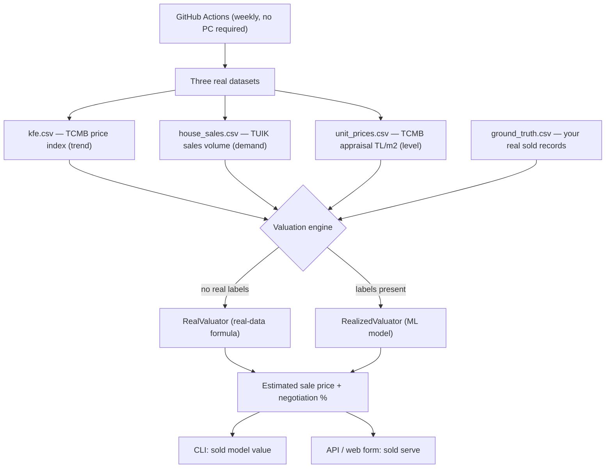

# sold

[](https://github.com/onatozmenn/sold/actions/workflows/ci.yml)
[](https://github.com/onatozmenn/sold/actions/workflows/kfe-refresh.yml)
[](https://www.python.org/)
[](LICENSE)
[](tests/)
[](#data-sources)

> Estimate the **realized** (transaction) sale price of a Turkish home from its **asking** price — using only real, official data.

**sold** is a residential valuation engine for the Turkish market. Listing portals publish only *asking* prices, and the actual *sold* price of a property is not public anywhere in Türkiye. `sold` closes that gap by combining official appraisal data (TCMB), housing demand (TÜİK), and published negotiation margins into a transparent, self-updating estimate of what a home will actually sell for — with **zero fabricated data**.

## Table of Contents

- [Background](#background)
- [How It Works](#how-it-works)
- [Data Sources](#data-sources)
- [Install](#install)
- [Usage](#usage)
- [Automation](#automation)
- [Project Structure](#project-structure)
- [Testing](#testing)
- [Methodology & References](#methodology--references)
- [Roadmap](#roadmap)
- [Legal & Ethics](#legal--ethics)
- [Contributing](#contributing)
- [License](#license)
- [Acknowledgements](#acknowledgements)

## Background

### The problem

In the United States, MLS "sold data" makes transaction prices transparent. Türkiye has no equivalent:

- **Title deeds (Tapu)** record declared values that are systematically understated to reduce transfer tax.
- **No MLS** — no system publishes the price a home actually sold for.
- **Listing portals** expose only the **asking** price.

Consequently, automated valuation models (AVMs) trained naively on listings are biased upward, and there is no public label for "what it really sold for."

### The approach

`sold` does not try to *scrape* the missing data — it *estimates* it, the same way the industry does (e.g. Endeksa) and the way the academic literature validates:

> **sold price ≈ asking price × (1 − negotiation margin)**

Every term is grounded in real, citable data:

- the **asking price** is the input;
- the **negotiation margin** ("pazarlık payı") comes from published market reporting;
- it is adjusted by **real housing demand** derived from TÜİK sales volumes.

An independent **appraisal-based value** (TCMB TL/m² × area) is provided as a cross-check. When you supply your own real sold examples, a machine-learning model takes over and learns the margins directly from your data.

## How It Works



**Two-tier engine**

| Mode | When | What it does |
|------|------|--------------|
| `RealValuator` | Default (no labels yet) | `asking × (1 − published discount)`, demand-adjusted, with a TCMB TL/m² cross-check |
| `RealizedValuator` | Once you add real sold labels | Two-stage ML (hedonic price + sale-to-list discount) trained on your ground truth |

No synthetic or mock data is ever served. The simulator (`synthetic.py`) exists solely to unit-test the ML method.

## Data Sources

All data is fetched from the official **TCMB EVDS** API and refreshed automatically. Nothing is scraped.

| Dataset | Source | Meaning | Coverage |
|---|---|---|---|
| `datasets/kfe.csv` | TCMB | Residential Property Price Index (trend) | 2010 → now, monthly |
| `datasets/house_sales.csv` | TÜİK via EVDS | House sales counts (demand / liquidity) | 2013 → now, monthly, by province |
| `datasets/unit_prices.csv` | TCMB | Appraisal-based unit prices (TL/m²) | 2013 → now, quarterly, 77 provinces |
| `datasets/ground_truth.csv` | You | Real asking → sold examples (optional labels) | user-provided |

Published negotiation margins used by the default engine (İstanbul ≈ 10%, Ankara ≈ 5%, İzmir ≈ 8%) are sourced from Turkish market reporting — see [References](#methodology--references).

## Install

**Prerequisites:** Python 3.11+ and a free [TCMB EVDS API key](https://evds2.tcmb.gov.tr) (only required to refresh data yourself).

```bash
git clone https://github.com/onatozmenn/sold.git
cd sold

python -m venv .venv
source .venv/bin/activate          # Windows: .\.venv\Scripts\Activate.ps1

pip install -e ".[dev]"            # optional extras: .[model] .[api] .[postgres]
cp .env.example .env               # then set EVDS_API_KEY in .env
```

## Usage

### Estimate a sale price (CLI)

```console
$ sold model value 3200000 --province İstanbul --gross-m2 120
İlan: 3,200,000 TL  (İstanbul, 120 m²)
Tahmini satış: 2,880,000 TL   (yayınlı pazarlık ~%10)      # est. sale ≈ 2.88M (~10% below asking)
Bu ilan: 26,667 TL/m²  ·  İstanbul ort. (TCMB): 79,306 TL/m²
→ İlan, il ortalamasının %66 altında.                      # listing is 66% below the provincial average
```

### Run the web app / REST API

```bash
sold serve            # → http://127.0.0.1:8000  (web form + REST endpoints)
```

`POST /valuate` returns the estimate as JSON; `GET /` serves a simple form.

### Refresh the real data (requires `EVDS_API_KEY`)

```bash
sold evds kfe          --out datasets/kfe.csv
sold evds house-sales  --out datasets/house_sales.csv
sold evds unit-prices  --out datasets/unit_prices.csv
```

### Add real sold labels (lets the model learn)

```bash
sold gt add ...                       # or edit datasets/ground_truth.csv directly
sold gt analyze                       # negotiation statistics from your own data
sold model evaluate --source gt --folds 5
```

### Validate the ML method on simulated data (not a real prediction)

```bash
sold model demo
```

## Automation

Three GitHub Actions keep the project alive without your machine:

| Workflow | Trigger | Action |
|---|---|---|
| `kfe-refresh.yml` | weekly + manual | Pulls KFE, house sales, and unit prices; commits the updated CSVs |
| `report.yml` | on label change + weekly | Regenerates `datasets/report.md` |
| `ci.yml` | every push / PR | Runs the test suite |

Set the `EVDS_API_KEY` repository secret (Settings → Secrets and variables → Actions) to enable data refresh.

## Project Structure

```
src/sold/
  config.py          # settings (.env)
  evds/              # TCMB EVDS client: KFE, house sales, unit prices
  features/          # demand signal (market_heat) + feature builder
  model/             # valuation (real engine), estimator (ML), synthetic (tests only)
  groundtruth/       # real-label loading + analysis
  scraper/           # ToS-respectful pipeline (local demo only)
  db/                # SQLAlchemy models + PostGIS schema
  api/app.py         # FastAPI service + web form
  cli.py             # `sold` command-line interface
datasets/            # real, version-controlled data (auto-refreshed)
scripts/             # helper scripts (data fetch, report)
tests/               # offline unit / end-to-end tests
.github/workflows/   # CI + data refresh + report
```

## Testing

```bash
pytest -q             # 54 tests, fully offline (no network or API key required)
```

## Methodology & References

Using listings plus a published margin (instead of unavailable transaction data) is an established, peer-reviewed method:

- *Real estate listings and their usefulness for hedonic regressions* — Springer, 2021.
- *Aggregated Housing Price Predictions with No Information About Transactions* (Warsaw) — MDPI, 2024.

Negotiation-margin figures from Turkish market reporting: İstanbul ≈ 10%, Ankara ≈ 5%, İzmir ≈ 8%, rising to 15–20% in slow or high-inventory markets. Drivers include building age, distance to centre, and local inventory — the latter captured here via TÜİK sales volume.

## Roadmap

- [x] Real TCMB/TÜİK data pipeline (KFE, sales, TL/m²) with weekly auto-refresh
- [x] Real-data valuation engine (published margin + demand adjustment)
- [x] Ground-truth labeling with automatic ML takeover
- [ ] Issue-form label entry (add real sales from the browser)
- [ ] Per-district TL/m² once real labels allow it
- [ ] Public dashboard (GitHub Pages)

## Legal & Ethics

- **No scraping.** Only official APIs (TCMB / TÜİK via EVDS) are used; individual sold prices are never accessed.
- **Privacy (KVKK).** No personal data (names, phone numbers) is collected — only objective property attributes.
- **Purpose.** Valuation accuracy and price transparency, not tax enforcement or exposure.

## Contributing

Issues and pull requests are welcome. Please:

1. Open an issue to discuss significant changes first.
2. Keep the test suite green (`pytest`) and add tests for new behavior.
3. Never add scraped or fabricated data to the repository.

## License

Distributed under the **MIT License**. See [LICENSE](LICENSE).

## Acknowledgements

- **TCMB EVDS** — appraisal-based price index and unit prices.
- **TÜİK** — housing sales statistics.
- Turkish real-estate market reporting for published negotiation margins.
