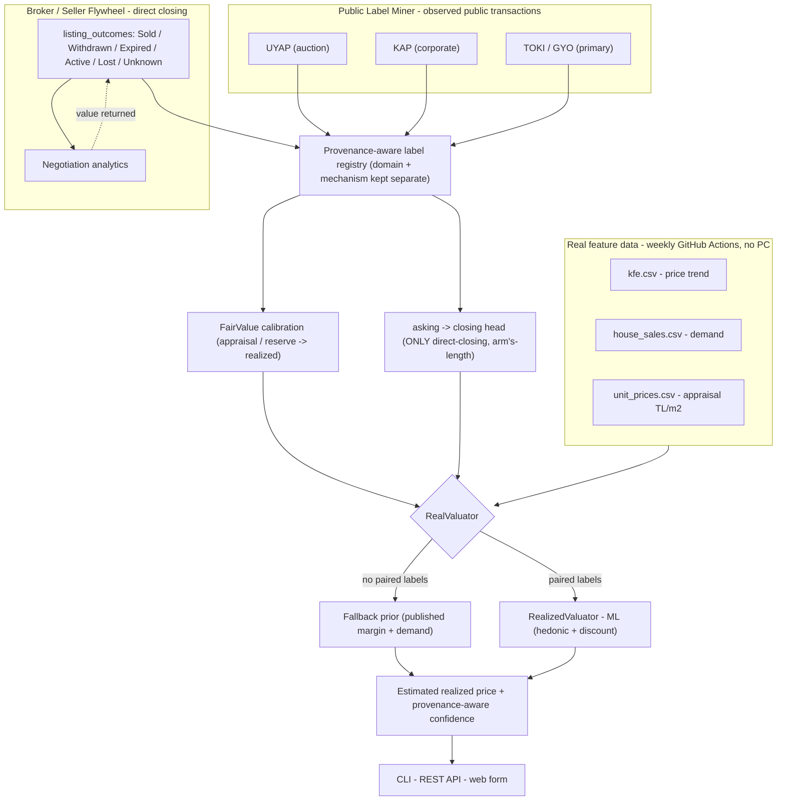

# sold

[](https://github.com/onatozmenn/sold/actions/workflows/ci.yml)
[](https://github.com/onatozmenn/sold/actions/workflows/kfe-refresh.yml)
[](https://www.python.org/)
[](LICENSE)
[](tests/)
[](#data-sources)

> Infer the **realized transaction price** of a Turkish home from its **asking** price — a provenance-aware valuation engine.

**sold** infers the **realized transaction price** of a Turkish home — the price it *actually* changes hands for — from its **asking** price. Because listing portals publish only asking prices and real transaction prices are public nowhere in Türkiye, the central challenge is **not** modeling but **label acquisition**. `sold` is therefore built as a *provenance-aware* inference engine: it learns the gap between asking and closing prices from sparse, trust-tagged transaction labels, and falls back to a transparent, official-data baseline (TCMB appraisal levels + TÜİK demand + published negotiation margins) until those labels arrive. No fabricated data is ever served.

## Table of Contents

- [Background](#background)
- [How It Works](#how-it-works)
- [Broker Data Flywheel](#broker-data-flywheel)
- [Public Label Bootstrap](#public-label-bootstrap)
- [Data Sources](#data-sources)
- [Labels & Provenance](#labels--provenance)
- [Install](#install)
- [Usage](#usage)
- [Automation](#automation)
- [Project Structure](#project-structure)
- [Testing](#testing)
- [Methodology & References](#methodology--references)
- [Roadmap](#roadmap)
- [Legal & Ethics](#legal--ethics)
- [Contributing](#contributing)
- [License](#license)
- [Acknowledgements](#acknowledgements)

## Background

### The problem

In the United States, MLS "sold data" makes transaction prices transparent. Türkiye has no equivalent:

- **Title deeds (Tapu)** record declared values that are systematically understated to reduce transfer tax.
- **No MLS** — no system publishes the price a home actually sold for.
- **Listing portals** expose only the **asking** price.

Consequently, automated valuation models (AVMs) trained naively on listings are biased upward, and there is no public label for "what it really sold for."

### The approach

The missing data is not *scraped* — it is *inferred*, the way the industry does (e.g. Endeksa) and the way the academic literature validates (see [References](#methodology--references)). The relationship of interest is the **sale-to-list ratio**:

> **realized price = asking price × (1 − negotiation margin)**

The honest framing is that **this is a label-acquisition problem, not a modeling problem.** The engine has two regimes:

- **With paired labels** — when real `asking → closing` records exist, a machine-learning model *learns* the margin from them, conditioned on overpricing, time-on-market, price cuts, liquidity, and location.
- **Without labels (fallback)** — the margin defaults to a **published prior** (İstanbul ≈ 10%, Ankara ≈ 5%, İzmir ≈ 8%), demand-adjusted via TÜİK volumes. This is a *baseline*, not ground truth — a fixed per-city rate is only ever a starting point, since the sale-to-list ratio moves with the market cycle (homes can even close **above** asking in hot markets).

An independent **appraisal-based value** (TCMB TL/m² × area) is provided as a cross-check.

## How It Works



**Two-tier engine**

| Mode | When | What it does |
|------|------|--------------|
| `RealValuator` | Default (no labels yet) | `asking × (1 − published discount)`, demand-adjusted, with a TCMB TL/m² cross-check |
| `RealizedValuator` | Once you add real sold labels | Two-stage ML (hedonic price + sale-to-list discount) trained on your ground truth |

No synthetic or mock data is ever served. The simulator (`synthetic.py`) exists solely to unit-test the ML method.

### Model decomposition

The problem naturally splits into three models; conflating them is what makes naive AVMs biased:

| Model | Question | Status |
|---|---|---|
| **FairValue** `V(x, t)` | What is the home worth *before* negotiation? | appraisal-anchored (TCMB TL/m²) |
| **SaleProbability** `P(sold ≤ N days)` | Will this listing actually sell — or just be withdrawn? | roadmap |
| **ClosingDiscount** `log(closing / asking)` | How far from asking does it truly close? | fallback prior → ML on real labels |

A delisted listing is **not** necessarily a sale (the seller may have withdrawn, relisted, or switched agents), so `removed = sold` is deliberately avoided.

### Structural inference engine (core)

The **core engine is a mechanism-aware structural econometric model**, not weak-label aggregation. Ordinary negotiated resale is modeled as **generalized Nash bargaining**: with buyer valuation `B` and seller reservation `S`, trade occurs only when `B ≥ S`, and the closing price is `P = η·B + (1−η)·S` where `η` (seller bargaining power) is **estimated, never hard-coded**. The structural parameter vector `θ` — buyer/seller value distributions, `η`, buyer-arrival/market-tightness, and source/mechanism shifts — is fit by **Simulated Method of Moments**:

$$\hat\theta = \arg\min_\theta\; (m_{obs} - m_{sim}(\theta))' \, W \, (m_{obs} - m_{sim}(\theta))$$

Each public source enters as **structural moments under its own mechanism**, never pooled as ordinary-resale ground truth:

| Source | Structural role |
|---|---|
| **TCMB** TL/m² + KFE/YÖKFE | Hedonic **fair-value level anchor** (appraisal, *not* transactions). The log-linear hedonic gives **relative** characteristic premiums only — the listing-price **intercept is never used as the price level**. A **contemporaneous** provincial TL/m² is the level anchor **used directly** (`V = U_gt · m² · e^{β'ΔZ}`); the **KFE ratio** is applied **only** to roll an *older* anchor `U_{t0} · (KFE_t/KFE_{t0})` — a level is never multiplied by the full index again (no temporal double count) |
| **UYAP** e-Satış | **Structural auctions** (sold *and* unsold): bidder valuations from the buyer-value distribution vs the **statutory legal floor** `max(0.5·Q, priority_claims) + realization_costs`. `muhammen_bedel = appraised value Q`, **not** the reserve; unobserved floor components stay *partially observed* (`legal_floor_exact=false`), never fabricated. Structural observation preserves offer/bidder counts and **distinct** parcel / unit-net / unit-gross areas (never substituted) |
| **KAP** | Non-related negotiated real-estate disposals → moments over **`log(sale/appraisal)`** that help **jointly** calibrate bargaining power **and** an explicit **corporate mechanism/domain shift** (this is *not* "KAP gives η"; η is jointly estimated, never ordinary-resale truth) |
| **TOKİ** | Repeated cumulative disclosures **differenced within room-type strata** (same project, same table semantics, non-decreasing count *and* total) → period realized-sale cohort moments; a `revision_detected` guard blocks differencing on decreases, semantics changes or vanished strata (no property-level pairs, no asking→closing discount) |

For an ordinary listing, **asking price is a noisy strategic signal of the seller reservation** (not ground truth, not a ceiling): `S` is conditioned on asking, fair value and tightness, `B`/`S` are drawn, trades (`B ≥ S`) retained, and the **conditional-on-trade** closing distribution returned — median, mean, an **80% structural interval**, trade probability, and **mechanism-transfer sensitivity**. This is a **structural inference, never an observed closing price or a measured ordinary-resale accuracy**.

**Identification before estimation.** Optimizer convergence is *not* identification. `sold structural identify` inspects the **actual audited dataset** (`sold structural dataset` reports genuine audited observations separately from fixtures) and computes a numerical moment Jacobian `J(θ)=∂m_sim/∂θ'` (central differences, common random numbers) **restricted to the moments that are genuinely observed** — reporting available vs unavailable moments (with reasons), moment provenance by source, rank, singular values, condition number, weakly-identified directions, and per-parameter profile diagnostics. The status is three-way: `NOT_IDENTIFIED` (`rank(J) < dim(θ)`), `WEAKLY_IDENTIFIED` (full rank but severely ill-conditioned or flat profiles), or `IDENTIFIED`; the first two run prediction in **sensitivity mode**. No observation-count threshold is used as the criterion. Until an identified fit exists, `sold structural value` is labelled a **structural-method prototype using provisional parameters** — not a measured ordinary-resale model. See [`src/sold/structural/`](src/sold/structural/) and `sold structural dataset` / `identify` / `value` / `estimate`.

## Broker Data Flywheel

The scarce input — a paired `asking → closing` label — is collected through a **listing-outcome pipeline**, not a sold-only form. A broker (or the app) records the *outcome* of a listing and receives free **negotiation analytics** in return. That exchange is the flywheel, and it is a **first-class source for `RealValuator`**.

- **Outcomes collected:** `sold` · `withdrawn` · `expired` · `active` · `lost_to_other` · `unknown`. Closing-price fields appear **only** for `sold` — a delisting is never assumed to be a sale (this later trains **SaleProbability**).
- **Honest confidence:** a broker's self-reported closing does **not** get confidence `A`. It defaults to `B`, and is promoted to `A` only when independently verified (`evidence_verified`); declared deed values are `C`. Schema fields `evidence_type` / `evidence_verified` exist; document upload is intentionally deferred.
- **Analytics returned (non-ML, immediate):** transaction count, median & mean asking-to-closing discount, days to close, price-cut count, and discount split by price-cut status. The same function runs on a broker's own records and on the aggregate dataset, so **broker-vs-benchmark** comparison is ready to switch on once enough anonymized data accumulates.

```bash
sold flywheel record sold --province İstanbul --last-asking 3200000 \
     --sold-price 2900000 --price-cuts 1 --days-to-close 40
sold flywheel record withdrawn --province İzmir --last-asking 1500000
sold flywheel analytics
```

Equivalent REST endpoints: `POST /outcome` and `GET /analytics`. Sold arm's-length outcomes feed **ClosingDiscount**; all outcomes feed **SaleProbability** — the two stay separate conceptual components.

## Public Label Bootstrap

Rather than waiting on institutional access, `sold` can turn **operator-supplied** official public records into provenance-aware realized-price labels via a `PublicLabelMiner` with per-source adapters. This is a **parser layer, not continuous ingestion** — you hand it a record you already downloaded (an auction result, a KAP disclosure) and the adapter normalizes it. Nothing is discovered, fetched, or ingested automatically, and labels do **not** "flow in" on their own.

| Source | Adapter | Reference → Realized | Mechanism | Confidence |
|---|---|---|---|---|
| **UYAP** e-satış (judicial auction) | `UYAPAdapter` | appraisal → winning bid | `auction` | A |
| **KAP** (corporate disclosures) | `KAPAdapter` | appraisal *or* prior-appraisal → sale value | `corporate_negotiated_non_related` | A |
| **TOKİ / GYO** paired auction | `TOKIAdapter` | reserve → winning bid (same lot) | `public_auction` / `primary_market` | A |
| **TOKİ / GYO** project disclosure (**unpaired**) | `ProjectDisclosureAdapter` | *aggregate populations — not a pair* | `aggregation_level = cohort` | A |

Every label lands in a single **provenance-aware registry** with mandatory `domain`, `label_source`, `sale_mechanism`, and `reference_price_type` fields. `domain` is the **source-domain** axis (`kap` / `uyap` / `toki` / `broker` / `consumer`) so source-domain bias stays measurable, while `sale_mechanism` carries the economic mechanism separately. Two provenance subtleties are enforced by the KAP adapter. **Provenance boundary:** the **operator** manually extracts the structured fields (including `prior_appraisal_value`) from the audited disclosure representation — the adapter does **not** parse raw KAP free text. Given those structured fields it distinguishes a **current structured valuation** (`degerleme_raporu_hazirlandi` + `degerleme_tutari` → `appraisal`) from an operator-extracted **prior appraisal** (`prior_appraisal_value` → `prior_appraisal`), deriving the normalized `reference_price_type` and preserving its provenance. Second, it never calls a sale `arm_length` on the basis of `related_party = false` alone — it uses the more defensible `corporate_negotiated_non_related`.

**Not every official record is a paired label.** Some disclosures report **aggregate populations that must not be paired**. The TOKİ/GYO project disclosure *“Projede Benzer Nitelikte Olan Bağımsız Bölümlerin Ortalama Satış Fiyatları”* gives an **offered-inventory** average over one set of units and a **cumulative-realized-sales** average over a different, larger set — they are **different populations**, so turning them into a `reference_price → realized_price` pair (or computing a “closing discount” between them) would fabricate a relationship that isn’t in the data. These records are therefore **not** coerced into `RealizedLabel`; a separate **aggregate observation** abstraction ([`labels/aggregates.py`](src/sold/labels/aggregates.py)) represents each population on its own row — `aggregation_level = cohort`, `comparison_scope = unpaired_aggregate`, `observation_role ∈ {offered_inventory, cumulative_realized_sales}`, `project_id`, `as_of_date` — preserving room-type strata. It carries **no** `realized_price` / `reference_price` fields by construction, so it can never enter `asking_to_closing_labels()`.

### Three levels of validation, kept distinct

1. **Parser / adapter validation** — unit tests confirm each adapter maps fields to the schema correctly, on **illustrative fixtures**. ✅ done.
2. **Real-record validation** — the operator downloads one real official record per source, feeds its non-personal fields through the parser, and commits the **manually-audited expected output** (never the raw artifact) under [`validation/real_records/`](validation/real_records/). [`tests/test_real_records.py`](tests/test_real_records.py) then enforces `parser output == audited expectation` and pins `parser_version`. **Status: harness enforcing; all three real-record cases validated — zero skips.** (a) KAP notification `963554` ([`validation/real_records/kap.json`](validation/real_records/kap.json), a manually-audited Şişli/İstanbul disposal where the structured valuation is empty, so the operator-extracted `prior_appraisal_value` drives a `prior_appraisal` classification). (b) The TOKİ **Park Mavera III** project disclosure ([`validation/real_records/toki.json`](validation/real_records/toki.json)), validated as **two unpaired aggregate observations** (offered inventory vs cumulative realized sales) under a separate `AGGREGATE_PARSER_VERSION` — explicitly *not* a paired label and *not* a closing discount. (c) A **UYAP** completed judicial e-Satış auction ([`validation/real_records/uyap.json`](validation/real_records/uyap.json), an Ankara/Yenimahalle commercial unit): court appraisal `4,500,000 → 4,545,000` winning bid, `sale_mechanism = auction`, `reference_price_type = appraisal`, excluded from `asking_to_closing_labels()`. Its audit surfaced a real area-field trap — `509 m²` is the **cadastral parcel** surface and `32.5 m²` the unit's **net** usable area, so `gross_m2` stays **null** (509 is *not* injected); `gross_m2` was already optional, so no schema change was needed, and a per-record `compared_fields` asserts the null while `parcel_area_m2`/`unit_net_m2` are preserved as distinct provenance.
3. **Live source ingestion** — continuously fetching new records per source. ⬜ not built (a ToS-reviewed operator step, deliberately out of scope).

> Level-1 **illustrative fixtures** (e.g. [samples/labels/illustrative_kap.json](samples/labels/illustrative_kap.json)) use invented placeholder values to exercise the parser — the UYAP `5,000,000 → 5,400,000` figure is illustrative only. Level-2 **real-record** cases live separately under `validation/real_records/`, each with a manifest and manually-audited expected output — the validated ones are the real KAP disclosure **`963554`**, the TOKİ **Park Mavera III** project disclosure, and a **UYAP** completed judicial auction (Ankara/Yenimahalle). The two tiers are kept strictly separate and never conflated.

### Domains are never pooled

- `asking_to_closing_labels()` feeds the **asking → closing** ML head **only** with direct-closing observations (broker / seller, `reference = asking`, arm's-length). UYAP / KAP / TOKİ are **excluded**.
- `fair_value_labels()` is a **registry query, not a training set**. The four public relationships — appraisal→corporate-sale, appraisal→auction, reserve→auction, offered_avg→primary-market — are **distinct** and must not be pooled into one target. Use `fair_value_strata()` (splits by `domain` × `sale_mechanism` × `reference_price_type`, so source-domain bias stays measurable) and calibrate each stratum with its own model.

```bash
sold labels mine kap --file samples/labels/illustrative_kap.json --to-db
sold labels stats     # counts by domain / mechanism / confidence + the domain split
```

> **On collection:** the adapters *parse official records you provide*; live fetching is intentionally not shipped, consistent with the project's no-scraping stance.

## Data Sources

The datasets below are **features** (market context), not the prediction target. All are fetched from the official **TCMB EVDS** API and refreshed automatically; nothing is scraped. The prediction *label* — a paired `asking → closing` price — is separate and provenance-tracked (see [Labels & Provenance](#labels--provenance)).

| Dataset | Source | Meaning | Coverage |
|---|---|---|---|
| `datasets/kfe.csv` | TCMB | Residential Property Price Index (trend) | 2010 → now, monthly |
| `datasets/house_sales.csv` | TÜİK via EVDS | House sales counts (demand / liquidity) | 2013 → now, monthly, by province |
| `datasets/unit_prices.csv` | TCMB | Appraisal-based unit prices (TL/m²) | 2013 → now, quarterly, 77 provinces |
| `datasets/ground_truth.csv` | You | Real asking → sold examples (optional labels) | user-provided |

Published negotiation margins are used **only as a fallback prior** (İstanbul ≈ 10%, Ankara ≈ 5%, İzmir ≈ 8%), when no paired labels exist — see [References](#methodology--references).

## Labels & Provenance

The one genuinely scarce input is a *paired* `asking → closing` label. Not all labels are equally trustworthy, so every record in `datasets/ground_truth.csv` carries its provenance:

| Column | Meaning |
|---|---|
| `sale_mode` | `arm_length` · `auction` · `related_party` · `unknown` — non-arm's-length sales are excluded from the negotiation model |
| `label_source` | `broker_closing` · `bank_transfer_observed` · `deed_declared` · `uyap` · `manual` |
| `label_confidence` | `A` (observed transfer / broker closing) · `B` (manual) · `C` (declared deed value — understated) |

> A title-deed *declared* value is **not** the true consideration; it is systematically understated for tax reasons. The target is the **verified consideration** — the money that actually changes hands. Candidate high-quality label sources (in progress) include broker closings and TKGM Tapu Güvenilir Hesap bank-transfer records.

## Install

**Prerequisites:** Python 3.11+ and a free [TCMB EVDS API key](https://evds2.tcmb.gov.tr) (only required to refresh data yourself).

```bash
git clone https://github.com/onatozmenn/sold.git
cd sold

python -m venv .venv
source .venv/bin/activate          # Windows: .\.venv\Scripts\Activate.ps1

pip install -e ".[dev]"            # optional extras: .[model] .[api] .[postgres]
cp .env.example .env               # then set EVDS_API_KEY in .env
```

## Usage

### Estimate a sale price (CLI)

```console
$ sold model value 3200000 --province İstanbul --gross-m2 120
İlan: 3,200,000 TL  (İstanbul, 120 m²)
Tahmini satış: 2,880,000 TL   (yayınlı pazarlık ~%10)      # est. sale ≈ 2.88M (~10% below asking)
Bu ilan: 26,667 TL/m²  ·  İstanbul ort. (TCMB): 79,306 TL/m²
→ İlan, il ortalamasının %66 altında.                      # listing is 66% below the provincial average
```

### Run the web app / REST API

```bash
sold serve            # → http://127.0.0.1:8000  (web form + REST endpoints)
```

`POST /valuate` returns the estimate as JSON; `GET /` serves a simple form.

### Refresh the real data (requires `EVDS_API_KEY`)

```bash
sold evds kfe          --out datasets/kfe.csv
sold evds house-sales  --out datasets/house_sales.csv
sold evds unit-prices  --out datasets/unit_prices.csv
```

### Add real sold labels (lets the model learn)

```bash
sold gt add ...                       # or edit datasets/ground_truth.csv directly
sold gt analyze                       # negotiation statistics from your own data
sold model evaluate --source gt --folds 5
```

### Validate the ML method on simulated data (not a real prediction)

```bash
sold model demo
```

## Automation

Three GitHub Actions keep the project alive without your machine:

| Workflow | Trigger | Action |
|---|---|---|
| `kfe-refresh.yml` | weekly + manual | Pulls KFE, house sales, and unit prices; commits the updated CSVs |
| `report.yml` | on label change + weekly | Regenerates `datasets/report.md` |
| `ci.yml` | every push / PR | Runs the test suite |

Set the `EVDS_API_KEY` repository secret (Settings → Secrets and variables → Actions) to enable data refresh.

## Project Structure

```
src/sold/
  config.py          # settings (.env)
  evds/              # TCMB EVDS client: KFE, house sales, unit prices
  features/          # demand signal (market_heat) + feature builder
  model/             # valuation (real engine), estimator (ML), synthetic (tests only)
  groundtruth/       # real-label loading + analysis
  scraper/           # ToS-respectful pipeline (local demo only)
  db/                # SQLAlchemy models + PostGIS schema
  api/app.py         # FastAPI service + web form
  cli.py             # `sold` command-line interface
datasets/            # real, version-controlled data (auto-refreshed)
scripts/             # helper scripts (data fetch, report)
tests/               # offline unit / end-to-end tests
.github/workflows/   # CI + data refresh + report
```

## Testing

```bash
pytest -q             # 215 tests, fully offline (no network or API key required)
```

## Methodology & References

Using listings plus a published margin (instead of unavailable transaction data) is an established, peer-reviewed method:

- *Real estate listings and their usefulness for hedonic regressions* — Springer, 2021.
- *Aggregated Housing Price Predictions with No Information About Transactions* (Warsaw) — MDPI, 2024.

Negotiation-margin figures from Turkish market reporting: İstanbul ≈ 10%, Ankara ≈ 5%, İzmir ≈ 8%, rising to 15–20% in slow or high-inventory markets. Drivers include building age, distance to centre, and local inventory — the latter captured here via TÜİK sales volume.

## Roadmap

- [x] Real TCMB/TÜİK data pipeline (KFE, sales, TL/m²) with weekly auto-refresh
- [x] Fallback valuation engine (published margin prior + demand adjustment)
- [x] Provenance-aware ground-truth labels with automatic ML takeover
- [x] **Broker Data Flywheel** — listing-outcome collection + non-ML negotiation analytics
- [x] **Public Label Bootstrap** — provenance-aware registry + UYAP/KAP/TOKİ adapters with strict domain separation, plus an unpaired **aggregate observation** abstraction for cohort disclosures (TOKİ project averages)
- [x] **Real-record (Level-2) validation** — three independent official records validated against the parsers with manually-audited expected output (KAP `963554`, TOKİ Park Mavera III, UYAP `16766356960`); zero skips, `parser_version`-pinned, raw artifacts never committed
- [x] **Consumer direct-label acquisition path** — self-serve seller collector that turns a completed ordinary home sale into a provenance-aware **direct** label (`domain=consumer` · `seller_self_reported` · `ordinary_resale` · `reference=asking` · confidence `B`) eligible for `asking_to_closing_labels()` while public UYAP/KAP/TOKİ stay excluded; returns immediate non-ML seller analytics (initial/final ask-to-close gap, days to close, price cuts) and an **honest** segment benchmark (no fabricated benchmark when observations are insufficient)
- [x] **Direct-label quality gate (pre-ML)** — mandatory `origin` (`consumer_submission` / `test_fixture` / `demo_seed` / `manual_import`) so `asking_to_closing_labels()` **excludes test/demo by default** (opt-in `include_non_production=True`) and fixtures never inflate the genuine count; `quality_status` (`accepted`/`flagged`/`rejected`) that **hard-rejects only structurally impossible values** (non-positive price, closing-before-listing) and merely **flags** unusual ratios (extreme close-to-ask, final-above-initial, suspicious duration, duplicate) while preserving the original self-reported values; a privacy-preserving duplicate-candidate **fingerprint** (one-way SHA-256 over bucketed canonical non-personal fields that flags submissions collapsing to the **same canonical transaction fingerprint** — a canonical-fingerprint collision, **not** general near-duplicate similarity detection, and it does **not** identify a property or seller); genuine vs test/demo reported as **separate counts**
- [ ] **First genuine real-world label** — exactly one *actual* seller-submitted completed residential sale passing through the product path + quality gate. **Current genuine direct-label count: 0** — the end-to-end test proves the acquisition *path* works, not that a real-world label has been acquired
- [x] **Structural econometric core** — mechanism-aware generalized **Nash bargaining** (`P = ηB+(1−η)S`, `η` estimated, not hard-coded) fit by **Simulated Method of Moments**; TCMB-anchored hedonic fair value (relative premiums only, no listing intercept as level); structural UYAP auctions with the **statutory legal floor** (`muhammen_bedel` preserved as appraised value `Q`, never the reserve; partially-observed floors not fabricated); KAP `η`-calibration moments with a corporate mechanism shift; TOKİ cumulative-disclosure differencing into room-type cohort moments. Replaces weak-label aggregation as the core; the provenance registry and validated KAP/TOKİ/UYAP Level-2 records are kept; the consumer path is frozen as an optional future *validation* channel. No SaleProbability model yet
- [x] **Statutory-floor fix, TCMB double-count audit & identification diagnostics** — corrected the İİK acceptance floor to `max(0.5·Q, priority_claims) + realization_costs`; audited the fair-value anchor so a contemporaneous TL/m² level is not trend-adjusted twice (KFE ratio only when rolling an older anchor); expanded the UYAP/KAP/TOKİ structural dataset schemas + observed-moment constructors (area semantics preserved, `log(sale/appraisal)` KAP moments, revision-guarded TOKİ cohorts); added `sold structural identify` (Jacobian rank / singular values / condition number / weak directions / profile diagnostics → `NOT_IDENTIFIED` → sensitivity mode)
- [x] **Genuine structural dataset (measured, not synthetic)** — wired the three validated Level-2 records as the genuine audited seed under [`validation/structural/`](validation/structural/) (`source_audited=true`, kept distinct from fixtures): **1 UYAP auction** (sold; appraised `Q`=4.5M → winning 4.545M; parcel/net areas distinct, gross null; partial legal floor), **1 KAP negotiated disposal** (prior-appraisal 5.2M → sale 5.508M; `value_method=negotiation`), **1 TOKİ disclosure** (PMVR3 → **0** derivable period cohorts: differencing needs ≥2 consecutive disclosures). `m_obs` is rebuilt from this genuine data — **3 single-observation means** (`uyap_sale_prob`, `uyap_win/appraisal`, `kap log(sale/appraisal)`); variances/quantiles reported **unavailable** at n=1 (never guessed). Measured result: `sold structural dataset` + `sold structural identify` → **`NOT_IDENTIFIED`** (rank 2 / dim 6, condition number →∞), sensitivity mode; a three-way `WEAKLY_IDENTIFIED` status and moment-provenance/unavailability reporting were added
- [x] **Identification-contribution diagnostics (source-specific Jacobian + snapshots)** — `sold structural identify` reports per-source Jacobian ranks (`J_UYAP`/`J_KAP`/`J_TOKİ`/`J_combined`) restricted to each family's genuinely observed moments — answering *which source adds an independent parameter direction* (a local moment-sensitivity diagnostic, **not** causal or standalone identification) — plus a `--save-snapshot` before→after comparison (newly-unlocked moments, sample-size increases, rank / smallest-non-zero-singular-value / condition-number / status deltas). **Measured on the current genuine data: `J_UYAP` rank 1 (`uyap_sale_prob` degenerate at 1.0), `J_KAP` rank 1, `J_TOKİ` rank 0 (single disclosure, no cohort), `J_combined` rank 2 → still `NOT_IDENTIFIED` (dim 6).** Unlocking `toki_cohort_moments` / `uyap_win-over-appraisal_sd` / `kap_log_ratio_sd` requires additional **genuine audited** records (a second consecutive PMVR3 disclosure; a second sold + one unsold UYAP auction; a second KAP negotiated disposal) — operator-supplied official records; none were fabricated, so those moments stay unavailable and the status is unchanged. The moment-unlock machinery is verified with clearly-labelled fixtures (not counted in the genuine report)
- [x] **Genuine PMVR3 disclosure series → TOKİ period cohorts unlocked** — added two operator-audited consecutive Park Mavera III cumulative-realized-sales disclosures (`2019-10-31`, `2019-11-30`; the `2019-12-31` Level-2 case frozen). The existing revision/reconciliation guards derived **4 valid period cohorts** (Oct→Nov 2+1 & 3+1, Nov→Dec 2+1 & 4+1) and **reconciliation-blocked 3 strata** with `Δcount=0, Δtotal≠0` (5+1 Oct→Nov; 3+1 & 5+1 Nov→Dec — no division by zero, never reinterpreted as sales); the overall TOTAL-row difference is never used as a clean cohort. `toki_cohort_moments` moved **unavailable → available** (5 cohort/composition moments). **Honest measured result: these TOKİ moments are now observed but have _no simulated counterpart_ in the current structural model (a model-mapping gap, not a data gap — no new mechanism was added), so `rank(J_TOKİ)` stays 0, `rank(J_combined)` stays 2, and the status is unchanged `NOT_IDENTIFIED`.** Mapping TOKİ primary-market moments to `θ` is a deliberately-deferred future structural-model extension
- [x] **TOKİ reclassified as `external_cross_mechanism_benchmark` & KAP 265789→312317 audit (PENDING)** — the 5 genuine TOKİ cohort/composition moments are **not** labelled *unavailable* (they are observed and available); they are declared an **external cross-mechanism benchmark** that is deliberately **outside** the current SMM identification system (`moments_used_in_identification = 0`, reason: *no current model-implied primary-market counterpart*). `sold structural identify` reports this explicitly; **`rank(J_TOKİ)` stays 0 and was _not_ “fixed” by inventing a primary-market mechanism, and `θ` was _not_ shrunk to force rank**. Separately, a candidate second KAP negotiated disposal (records `265789→312317`, appraisal 15.487M TRY → sale 8.0M USD +VAT) is recorded under [`validation/structural/kap_candidates.json`](validation/structural/) as **`PENDING_AUDIT`** and **does not enter the genuine set / `kap_log_ratio` moments** — admission is blocked by conditions that cannot be verified without fabrication: same-transaction only *operator-linked* (#1), related-party *unverified* (#4), **currency mismatch** TRY vs USD with **no documented official TCMB rate** (#5,#6), and **VAT non-comparability** (#7,#8). Measured identification is therefore unchanged: `m_obs`=3, `J_UYAP` rank 1 / `J_KAP` rank 1 / `J_combined` rank 2, singular values `[1.73, 0.579, 0]`, condition →∞, **`NOT_IDENTIFIED` (rank 2 / dim 6)**. Still operator-blocked (never fabricated): 1 unsold + 1 additional sold UYAP auction, and an admissible same-currency/VAT-comparable second KAP disposal
- [x] **Genuine audited second KAP disposal (currency + VAT + related-party source-audited) → `kap_log_ratio_sd` unlocked, rank 2→3** — the previously `PENDING_AUDIT` KAP chain `265789→312317` was manually source-audited against the official KAP disclosure chain (linked as **one** Kapadık/Esenyurt, 382 ada 11 parsel disposal via the previous-notification reference — **not** two transactions), the official valuation-report attachment (`KDV Hariç`), and the official TCMB EVDS series `TP.DK.USD.A.YTL`. Final realized consideration `7,533,161 USD + KDV` (from completion update `312317`, superseding the earlier `8,000,000 USD` **proposal**) normalized to TRY at the documented buying rate `2.03650000` on the completion/conversion date `2013-10-01` → `15,341,282.3765 TRY`; appraisal `15,487,102 TRY`, both compared **excluding VAT** (no VAT added to either side); related-party from the official old-form `Karşı Taraf İle Olan İlişkinin Niteliği = Yoktur` → `related_party=false` (old-form provenance preserved; **no** modern structured SPK boolean invented). `log(sale/appraisal) = −0.009460159132789749`. Admitted as one genuine negotiated-disposal observation (`corporate_negotiated_non_related`; excluded from `asking_to_closing_labels()`). **Measured genuine identification gain: KAP negotiated count 1→2, `kap_log_ratio_sd` unavailable→observable, `m_obs` 3→4, `rank(J_KAP)` 1→2, `rank(J_combined)` 2→3, singular values `[1.706, 0.678, 0.118, 1.3e-18]`, smallest non-zero sv `0.579→0.118`; status stays `NOT_IDENTIFIED` (rank 3 / dim 6) — real data raised the rank without touching θ, TOKİ stays `external_cross_mechanism_benchmark`, and no ML / weak-supervision / fourth-source layer was added.** UYAP still operator-blocked: 1 unsold + 1 additional sold auction
- [x] **Genuine audited second sold UYAP auction (e-Satış `16662608597`) → `uyap_win_over_appraisal_sd` unlocked, rank 3→4** — manually source-audited from the public e-Satış portal + official auction documents (Ankara/Altındağ dükkan): `Takdir Olunan Değer/Kıymeti = 13,000,000 TRY` kept as `appraised_value = Q` (court-appraised value, **not** the reserve/floor), official result `İhale Bedeli 6,550,000 TRY` on `03/06/2026` with `En Yüksek Teklif Verene Malın İhale Edilmesi` → `sold=true`. `winning_bid/appraised_value = 0.5038461538461538` (auction ratio, **not** an ordinary-resale asking-to-closing discount; `domain=uyap`, `sale_mechanism=auction`, excluded from `asking_to_closing_labels()`). Area semantics preserved and **never interchanged**: `parcel_area_m2=1864.72`, `unit_net_m2=325.00`, `unit_gross_m2=350.00`. `priority_claims`/`realization_costs` not sufficiently observed → `legal_floor_exact=false` (50% of Q is a lower bound, not an exact floor). Privacy boundary: no party/representative/counsel/payment/case-party data transcribed — only non-personal economic/property/public-record fields. **Measured genuine identification gain (θ unchanged): UYAP genuine sold 1→2 (2 sold, 0 unsold, `sale_prob` still degenerate 1.0), `uyap_win_over_appraisal_sd` unavailable→observable (mean `0.7569`, sd `0.2531`), `m_obs` 4→5, `rank(J_UYAP)` 1→2, `rank(J_KAP)` 2, `rank(J_combined)` 3→4, singular values `[1.760, 0.975, 0.214, 0.0285, 1.0e-17]`, smallest non-zero sv `0.118→0.0285`, condition `1.7e17`, weak direction `{sigma_s:0.80, mu_s:0.59, eta:-0.07}`; every currently-modeled moment is now observed (`unavailable_moments` empty) yet status stays `NOT_IDENTIFIED` (rank 4 / dim 6) — the remaining gap is degenerate `sale_prob` + limited variation, not a missing moment. TOKİ stays `external_cross_mechanism_benchmark`; no ML / weak-supervision / fourth-source layer added.** UYAP still operator-blocked: 1 unsold auction (to break the degenerate sale probability)
- [x] **UYAP outcome-taxonomy correction, invalid `uyap_sale_prob` removed, pivot to PARTIAL IDENTIFICATION + identification-aware prediction** — the actual authenticated e-Satış interface exposes four top-level states (`Satıldı`, `Birinci Alıcıya Süre Verildi`, `Malın Satışının Düşmesi`, `İhale Sonucu Girilmemiştir`); **no fifth status was invented** to unlock a sale probability. Only `Satıldı` is a terminal completed sale; settlement-pending / missing-result are **censored** (not `sold=false`), and `Malın Satışının Düşmesi` is reason-dependent (withdrawal/`Satıştan Vazgeçilmesi` is administrative, **not** a market no-trade). Because the public taxonomy cannot separate a comparable negative auction-trade class, **`uyap_sale_prob` was removed from `m_obs`, the simulated moments, and the Jacobian** (documented reason: *public UYAP outcome taxonomy does not currently identify a comparable negative auction trade class*; raw taxonomy + reason preserved for future research, never replaced with a guessed rate). The conditional moments `uyap_win_over_appraisal_mean/sd` are kept, explicitly interpreted as *winning_bid/appraised_value conditional on an observed completed sale*. **Measured effect: removing the degenerate `sale_prob=1.0` moment dropped `m_obs` 5→4 but improved conditioning — condition number `1.7e17 → 61.8` (the spurious ~0 singular value vanished), `rank(J_combined)` stays 4/dim 6.** The final inference gate pivots from forced point identification to **partial identification** `Θ_I = {θ : Q(θ) ≤ Q_min + tol}` (explicit, sensitivity-tested tolerance `tol = max(1e-4, rel·|Q_min|)`, common random numbers, reproducible sampling) via `sold structural partial` — measured `mu_b`/`sigma_b`/`auction_shift` point-like, `mu_s`/`sigma_s`/`eta` **set-identified**, with parameter trade-off correlations. `sold structural value --partial` produces an **identification-aware** closing range that separates *within-θ negotiation uncertainty* from *between-θ identification uncertainty* (`identification_status = PARTIALLY_IDENTIFIED`), never called an observed price or measured ordinary-resale accuracy. θ was **not** shrunk to recover rank; TOKİ stays external; no ML / weak-supervision / SaleProbability / fourth source added. The public-source UYAP no-trade hunt is closed
- [x] **Econometric terminology correction (near-fit set) + input-conflict diagnostic; core frozen** — the near-minimum SMM criterion level set was renamed `admissible_near_fit_set` (`Θ_A`) and is explicitly **not** described as a formally estimated identified set, a confidence region, or any coverage claim: *the set of economically admissible structural parameter vectors whose SMM criterion lies within the documented near-fit tolerance of the best observed-moment fit* (the tolerance `max(1e-4, rel·|Q_min|)` is a documented numerical/sensitivity rule, **not** a sampling-calibrated cutoff). Local point-identification diagnostics are preserved (`Jacobian rank = 4`, `dim(θ) = 6`) and the reported status is **`STRUCTURALLY_UNDERIDENTIFIED`**. The prediction envelope across `Θ_A` is a **near-fit structural parameter uncertainty envelope** / *structural sensitivity range* — separating *within-θ negotiation uncertainty* from *between-θ near-fit parameter uncertainty* — never a confidence interval or a measured-coverage prediction. A `FUTURE_METHODOLOGY_NOTE` records that a formally calibrated confidence region would need an inference procedure whose criterion cutoff accounts for sampling uncertainty. Added an **input-conflict diagnostic**: `ask_to_fair_value_ratio = asking_price / fair_value` is computed and an explicit `input_conflict` warning is emitted when it falls outside documented configurable bounds (default `[0.5, 2.0]`) — the prediction is **never silently clamped or rejected**; the six economic explanations (`possible_input_error`, `geographic_anchor_mismatch`, `property_characteristic_mismatch`, `distressed_or_nonstandard_sale`, `fractional_or_encumbered_interest`, `strategic_underpricing`) are surfaced as **candidate diagnostic categories only**, never auto-assigned without evidence. Frozen: UYAP+KAP dual-mechanism core, TOKİ external benchmark, `uyap_sale_prob` excluded, the two genuine UYAP + two genuine KAP observations; no ML / weak-supervision / SaleProbability / fourth source / new mechanism. **Econometric core frozen; next is productization + dataset expansion.**
- [x] **Final product surface over the frozen structural engine (honest, demo-ready)** — a polished single-page structural valuation UI (tabs **Değerle / Model Evidence / Method**) and a machine-readable API replace the legacy development form. `POST /structural/valuate` returns `methodology=structural_econometrics`, `identification_status=STRUCTURALLY_UNDERIDENTIFIED`, `coverage_claim=null`, `central_structural_estimate`, `within_theta_negotiation_interval`, `between_theta_near_fit_band`, `structural_sensitivity_range`, `ask_to_fair_value_ratio`, `input_conflict` (+ warning), genuine `2/2/5` UYAP/KAP/TOKİ counts, `jacobian_rank`/`parameter_dimension`/`near_fit_parameter_count` — and **never** a `confidence_interval` or `accuracy` field. The result hierarchy shows the central estimate, within-θ vs between-θ uncertainty, and the sensitivity envelope with the visible statement *"This is not a confidence interval and carries no frequentist coverage claim."* `GET /structural/evidence` reports the genuine public evidence honestly (UYAP conditional-on-completed-sale, KAP corporate-negotiated ≠ ordinary-resale ground truth, TOKİ external = 0 SMM moments) and **does not** display test counts as evidence; `GET /structural/method` explains the mechanism (`TCMB anchor → fair value`, `UYAP/KAP → moments`, `SMM → Θ_A`, `trade iff B≥S`, `P=η·B+(1−η)·S`, `simulation across Θ_A → structural sensitivity range`) with `η` **not** measured from KAP and appraised value **not** the auction reserve; the `[0.5, 2.0]` ask/fair conflict bounds are documented as **configurable product diagnostics, not econometric thresholds**. Input-conflict surfaces an explicit warning with the ratio and the six **candidate** explanation categories (never auto-assigned), and the estimate is **never silently clamped or rejected**. One test-backed correctness fix to the prediction summary: the identification-aware envelope no longer collapses to null when only the single best-fit θ trades zero — it is built from the near-fit configurations that actually trade, while still reporting an honest null when **no** admissible θ trades. Frozen: structural core, TOKİ external, `uyap_sale_prob` excluded, 2 UYAP + 2 KAP; no ML / weak-supervision / SaleProbability / fourth source / new mechanism / auth / billing.
- [x] **Prediction-semantics correctness + Θ_A numerical-robustness audit (pre-expansion)** — traced and fixed the central/within-θ inconsistency: previously the central estimate could be a cross-θ median-of-medians while the within-θ interval came from a different single θ, so the central estimate could fall **outside** its own interval. Now a single **representative trading near-fit configuration** is chosen (the trading θ whose conditional-on-trade median is closest to the cross-θ median, deterministic tie-break) and **both** `central_structural_estimate` and `within_theta_negotiation_interval` are reported from it, so the central estimate lies inside its own interval **by construction** (`central_estimate_definition` / `representative_theta_rule` exposed in metadata). Made conditional-on-trade explicit: `price_estimate_condition=conditional_on_trade`, a permanent statement that the price distribution is computed conditional on `B≥S` (not an unconditional expected sale), primary label *"Central structural estimate, conditional on simulated trade"*, and reconciling counts `near_fit_parameter_count = trading_near_fit_parameter_count + nontrading_near_fit_parameter_count`, `price_envelope_theta_count == trading` (non-trading θ never receive synthetic zero prices; honest null preserved when no θ trades). Corrected the trade field: `trade_probability_band`/`simulated_trade_share_band` is the **Monte-Carlo simulated B≥S share** with `trade_share_calibration=not_empirically_calibrated_to_observed_uyap_no_trade_outcomes` — never a probability of sale / sale likelihood (a simulated share of zero is not proof the population trade probability is zero). Added a reproducible **search-budget stability** study (`GET /structural/stability`, budgets 750/1500/3000, common random numbers, unchanged tolerance/bounds/criterion) with a documented rule → **`near_fit_search_stability = INSUFFICIENT_COVERAGE`**: the finite search finds increasingly many near-fit vectors with budget — the expected numerical signature of a rank-4/6 underidentified region (a large near-flat manifold along ~2 weakly-constrained directions), **not** a code defect. The reproducible sampler was improved (multi-start Nelder-Mead descent to a per-budget `Q_min` + iterative local refinement) — numerical exploration only. Frozen: `STRUCTURALLY_UNDERIDENTIFIED`, rank 4/6, Θ_A/tolerance definition, SMM moments, 2 UYAP + 2 KAP, TOKİ external, `uyap_sale_prob` excluded, TCMB anchor, Nash equation. **Prediction semantics frozen; next is genuine UYAP/KAP evidence expansion.**
- [x] **Search-budget stability methodology audit (cumulative, incumbent-preserving)** — audited why a larger numerical budget had reported a *worse* best objective (`3000` → `0.111` vs `1500` → `0.076`). Root cause: the old study ran **independent, non-nested** searches per budget (same seed, different `n_candidates` → different draws), so a larger budget did **not** retain the smaller budget's best theta — an incumbent-loss / non-nested exploration artefact, **not** underidentification. Redesigned the study as a **cumulative incumbent-preserving experiment** (`cumulative_near_fit_experiment`): nested candidate pools (`pool(bₖ) ⊇ pool(bₖ₋₁)`), every candidate evaluated once under common random numbers, the global incumbent always retained → **`cumulative_best_objective` is monotone non-increasing** (`[0.101, 0.066, 0.065, 0.065]` for `750/1500/3000/6000`), and re-evaluating the incumbent is byte-deterministic (`incumbent_reeval_delta = 0`). All budgets are compared under **one common reference minimum** `Q_ref = min` over the whole cumulative experiment with `tol_ref = max(1e-4, rel·|Q_ref|)` (no moving admission threshold); the table reports both `production_near_fit_count` (own moving `Q_min`) and `common_threshold_stability_near_fit_count`. Replaced the count-growth-only rule with a documented **multi-part** convergence rule (cumulative best-objective improvement, common-threshold parameter-support expansion, envelope/band/central endpoint movement) → **`near_fit_search_stability = INSUFFICIENT_COVERAGE`**: at budget `6000` the common-threshold support is still expanding outward (`eta` lower endpoint `0.80 → 0.38`) so a stability judgment is premature. Crucially, `near_fit_search_stability` is reported **separately** from `identification_status`; unstable numerical search is **not** stated to prove or be an expected signature of underidentification. Frozen: `STRUCTURALLY_UNDERIDENTIFIED`, rank 4/6, Θ_A / tolerance formula, SMM moments, 2 UYAP + 2 KAP, TOKİ external, `uyap_sale_prob` excluded, TCMB anchor, Nash equation, and all `ea5b150` prediction semantics. **Search-approximation layer frozen; next is genuine UYAP/KAP evidence expansion.**
- [ ] **SaleProbability** model (`P(sold ≤ N days)`) trained on collected outcomes
- [ ] Live, ToS-reviewed fetchers for the public label sources
- [ ] Broker-vs-benchmark analytics over an aggregate anonymized dataset
- [ ] Institutional label sources — TKGM Tapu Güvenilir Hesap, GABİM/TADEBİS, TÜİK microdata
- [ ] Public dashboard (GitHub Pages)

## Legal & Ethics

- **No scraping.** Only official APIs (TCMB / TÜİK via EVDS) are used; individual sold prices are never accessed.
- **Privacy (KVKK).** No personal data (names, phone numbers) is collected — only objective property attributes.
- **Purpose.** Valuation accuracy and price transparency, not tax enforcement or exposure.

## Contributing

Issues and pull requests are welcome. Please:

1. Open an issue to discuss significant changes first.
2. Keep the test suite green (`pytest`) and add tests for new behavior.
3. Never add scraped or fabricated data to the repository.

## License

Distributed under the **MIT License**. See [LICENSE](LICENSE).

## Acknowledgements

- **TCMB EVDS** — appraisal-based price index and unit prices.
- **TÜİK** — housing sales statistics.
- Turkish real-estate market reporting for published negotiation margins.
